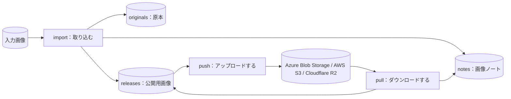
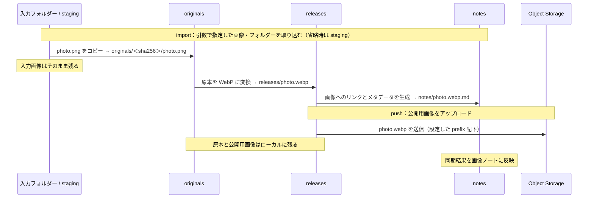
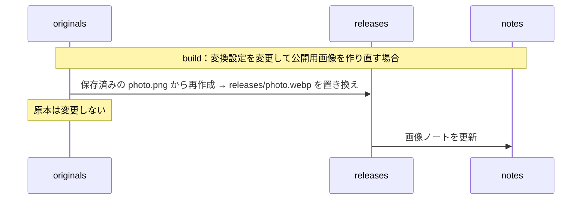
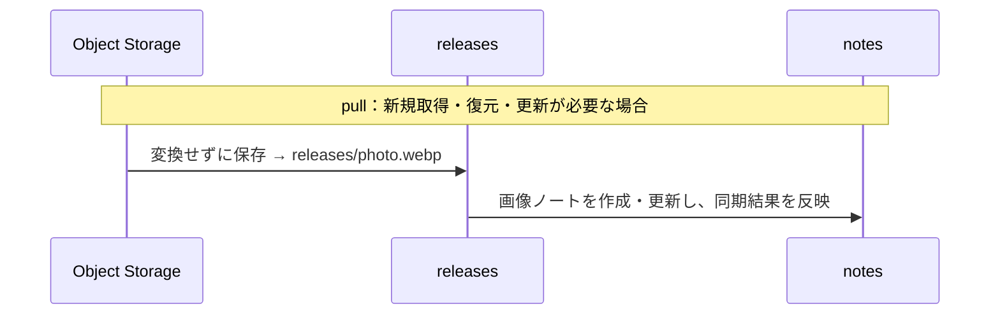
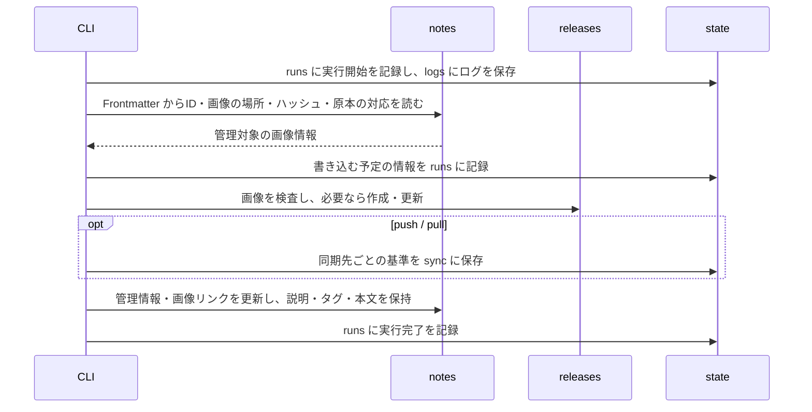

# tkn-objstorage-imgcatalog: Tkn Object Storage Image Catalog

Azure Blob Storage・AWS S3・Cloudflare R2 の画像を、手元の原本・公開用画像・Obsidian の Markdown メタデータと対応付けて管理するカタログ CLI です。
1つの source が特定のコンテナーまたはバケットに対応します。画像ごとの説明、タグ、関連はノートに記録できます。

たとえば PNG を取り込むと、原本をそのまま保存したうえで、アップロード用の WebP と、説明文・タグ・関連プロジェクトを書き込めるノートを作成します。
アップロードで送信するのは公開用の画像だけです。
ダウンロードでは、クラウドに保存されているバイト列をそのまま取得します。
どちらの操作も、コンテナーやバケットの匿名公開アクセスを必要としません。

初めて使う場合は、「[1. これは何か](#1-これは何か)」から「[3. 実行する](#3-実行する)」までを上から順に読みます。
「[4. コマンド一覧](#4-コマンド一覧)」以降は、必要になったときに目的の項目を参照します。

## 1. これは何か

### 1.1. 得られる結果の例

`photo.png` を取り込むと、次の3つが作成されます。

| 作成されるもの | 保存先（データ保存領域からの相対パス） | 使い道 |
| --- | --- | --- |
| 原本の写し | `originals/<sha256>/photo.png` | 変換前のバイト列を保持します。変換設定を変えて作り直すときの元になります。 |
| 公開用の画像 | `releases/photo.webp` | 選択した Object Storage へアップロードする画像です。 |
| 画像ノート | `notes/photo.webp.md` | 説明、タグ、関連プロジェクトなどを書き込みます。 |

画像ノートは、次のような Markdown です。
以下は説明用の例で、CLI が管理する項目の一部を省略しています。

```markdown
---
type: image
title: photo
description: 2026年春の展示会で撮影したブースの全景
category: .
tags: [展示会]
nouns: []
domains: []
projects: [spring-exhibition]
assetId: <asset-id>
noteId: <note-id>
url: https://examplestorage.blob.core.windows.net/images/photo.webp
syncStatus: synced
---
# photo

<!-- object-storage-catalog:begin -->


[Local image](file:///C:/path/to/data/releases/photo.webp)

[Remote image (access permissions apply)](https://examplestorage.blob.core.windows.net/images/photo.webp)
<!-- object-storage-catalog:end -->

ここから下は自由に書けます。
```

`title`、`description`、`tags` などと本文は、利用者が編集する項目です。
`assetId`、`url`、`syncStatus` など、および `object-storage-catalog:begin` から `object-storage-catalog:end` までのブロックは、CLI が更新します。
CLI は、利用者が編集した項目、独自に追加したプロパティ、ブロック外の本文を保持します。

### 1.2. 対象範囲

| 区分 | 内容 |
| --- | --- |
| 扱うもの | 画像ファイル（`.apng` `.avif` `.bmp` `.gif` `.ico` `.jpg` `.jpeg` `.png` `.svg` `.tif` `.tiff` `.webp`） |
| 自動で変換するもの | 静止画の JPEG と PNG を WebP に変換します。それ以外の形式とアニメーション PNG は、変換せずにコピーします。 |
| 扱わないもの | 画像以外のファイル、動画（WebM への変換を含む） |
| 行わないこと | ストレージ アカウント・コンテナー・バケットの作成、アクセス権の変更、独自ドメインや HTTPS の設定、クラウド上のオブジェクトの削除、生成 AI による分類 |

主な対象環境は Windows です。

### 1.3. 最初に必要な用語

| 用語 | 意味 |
| --- | --- |
| 原本（original） | 取り込んだ入力ファイルの写しです。取り込み後に編集されることはありません。 |
| 公開用画像（release） | アップロードの対象になる画像です。原本を変換またはコピーして作ります。 |
| 画像ノート | 画像1枚に対応する Markdown ノートです。説明や関連を書き込みます。 |
| アセット | 原本・公開用画像・画像ノートをひとまとめにした管理単位です。変わらない識別子（アセット ID）を持ちます。 |
| 同期の基準（baseline） | 最後に同期が完了した時点の内容の記録です。次回の同期で、手元とクラウド のどちらが変わったかを判定するために使います。 |

アセット ID は、ファイル名やノートのタイトルとは独立しています。
ノートのタイトルやカテゴリーを変えても、画像のファイル名、オブジェクトキー、URL は変わりません。

### 1.4. 全体像

次の図は、コマンドとデータの関係を示します。
長方形は処理、円筒形はデータです。
矢印はデータの流れを表します。



`import` は手元だけで完結し、クラウドへ接続しません。
クラウドへ接続するのは、`push`、`pull`、および `--remote` を付けた `status` と `verify` です。
`push` と `pull` は、同期の結果を画像ノートの `syncStatus` にも反映します。

設定と実行時のデータは、このソース リポジトリの外に保存します。
既定の保存先は、ホーム フォルダー配下の `~/.tkn/objstorage-imgcatalog/` です。
各フォルダーの役割は「[6. 保存構造](#6-保存構造)」で説明します。

### 1.5. フォルダー間のデータの流れ

以下は、`photo.png` を取り込み、`photo.webp` として扱う例です。
各図は上から下へ処理が進みます。矢印は、CLI によるコピー・変換・転送を表します。
**入力画像は移動・削除されず、`staging` に置いた画像も取り込み後に残ります。**

図中のローカルフォルダーは `<data_root>/` 配下です（既定では `~/.tkn/objstorage-imgcatalog/data/<source-id>/`）。
`notes_root` を指定した場合だけ、ノートはその指定先に保存されます。
正常に書き込みを行う場合の流れを示し、競合による停止や `--dry-run` は省略しています。

**取り込み → アップロード：`import` → `push`**



変換対象は静止画の JPEG・PNG です。その他の対応形式や `--no-convert` の場合は、原本と同じ形式・内容を `releases` にコピーします。
`notes` に保存するのは Markdown で、画像自体は `releases` にあります。クラウドに送るのも `releases` の画像だけです。

**原本から再作成：`build`**



`build` はローカルで完結します。クラウドへ反映するには、続けて `push` を実行します。
形式変更で拡張子が変わる場合は `build` が停止するため、`import --name` で別名として取り込みます。

**クラウドから取得・復元：`pull`**



`pull` は `staging` や `originals` を経由せず、クラウドの画像を直接 `releases` に保存します。
ダウンロードで新規取得・置き換えした画像には原本との対応がなく、`build` の対象になりません。既存の `originals` のファイル自体は残ります。
手元とクラウドの内容が同じ場合は、画像を置き換えません。
`build` と `pull` は置き換え前の公開用画像を保存しません。旧版が必要な場合は、実行前のバックアップから戻します。

**管理データの流れ：ノートを読み、処理結果をノートと state に保存する**



画像1枚の管理情報は、その画像のノートに集約します。画像のID・原本との対応・ハッシュ・変換条件の指紋は Frontmatter に保存し、CLI もここを読み取ります。ノートは説明を書く場所と管理台帳を兼ねるため、画像と一緒にバックアップしてください。
同期基準・実行記録・復旧情報は `state` に保存します。`recover` は中断した実行の `state/runs` を読み、書き込み済みの画像と記録が一致する場合にノートへの反映を完了します。
各保存先の役割は「[6. 保存構造](#6-保存構造)」を参照してください。

## 2. セットアップ

### 2.1. 前提

- Python 3.11 以降
- [uv](https://docs.astral.sh/uv/)
- Object Storage と同期する場合：既存のコンテナーまたはバケットと、読み書きできる認証情報
- Azure CLI 認証を使う場合：[Azure CLI](https://learn.microsoft.com/cli/azure/install-azure-cli)
- AWS S3 / Cloudflare R2：AWS SDK が読み取れる認証プロファイルまたは環境変数。AWS CLI はプロファイル設定用に利用できます。

取り込み（`import`）、再作成（`build`）、ノートの更新（`notes refresh`）は、クラウドの認証なしで実行できます。

### 2.2. インストール

クローンしたリポジトリのフォルダーへ移動し、インストールします。
`C:\path\to\tkn_objstorage_imgcatalog` は、実際のフォルダーのパスに置き換えます。

```shell
cd "C:\path\to\tkn_objstorage_imgcatalog"
uv tool install .
```

WebP 変換に使う Pillow を含め、必要な Python パッケージは一緒にインストールされます。

インストールできたことを確認します。

```shell
tkn-objstorage-imgcatalog --version
```

`tkn-objstorage-imgcatalog 0.6.0` のようにバージョンが表示されれば、インストールは完了しています。
コマンドが見つからない場合は、`uv tool update-shell` を実行してから、新しいターミナルを開きます。

コマンドとオプションの一覧は `tkn-objstorage-imgcatalog --help` で確認できます。
`--version` と `--help` は、設定やクラウドの認証が済んでいなくても表示されます。

### 2.3. 設定ファイルの作成

設定ファイルを作成し、作成先と現在の設定値を確認します。

```shell
tkn-objstorage-imgcatalog config init
tkn-objstorage-imgcatalog config list
```

`config init` は、`~/.tkn/objstorage-imgcatalog/config.yaml` に設定ファイルのひな形を作成し、そのパスを表示します。
`config list` は、有効な設定値と、各値がどの設定ファイルに由来するかを表示します。

実環境テストの接続先も、この `config.yaml` の `integration_tests` に登録できます。
通常の `sources` とは別に管理し、テスト時の保存先は毎回分離します。秘密値は記載しません。
登録と実行方法は [Azure / R2 / S3 実環境統合テスト](docs/testing/live-storage.md) を参照してください。

### 2.4. 接続先と認証の設定

作成された `config.yaml` を開き、source の `provider` と対応する接続設定を変更します。
以下はそれぞれ単独で使える最小構成です。`my-obj-storage-1` は任意の source ID です。
画像の変換・保存先・配信 URL は、接続先によらず同じ設定を使います。

**Azure Blob Storage**

```yaml
schema_version: "3.2.0"
sources:
  my-obj-storage-1:
    provider: azure
    azure:
      account_url: https://examplestorage.blob.core.windows.net
      container: images
```

Azure CLI でサインインします。

```shell
az login
```

読み書きには対象コンテナーへの「ストレージ BLOB データ共同作成者」、読み取りだけなら「ストレージ BLOB データ閲覧者」が目安です。
[Microsoft Entra ID による BLOB へのアクセス承認](https://learn.microsoft.com/azure/storage/blobs/authorize-access-azure-active-directory)も参照してください。
Azure 上では `azure.auth: managed_identity` も選べます。

**AWS S3**

```yaml
schema_version: "3.2.0"
sources:
  my-obj-storage-1:
    provider: s3
    s3:
      bucket: example-images
      region: ap-northeast-1
      profile: images
```

`profile` は AWS の共有設定・認証情報に登録したプロファイル名です。
たとえば AWS CLI の `aws configure --profile images` で設定します。
IAM Identity Center の場合は、設定済みのプロファイルで `aws sso login --profile images` を実行します。
`profile` を省略すると、環境変数やロールなど、Boto3 の標準の認証情報探索を使います。
読み取りには対象バケットの `s3:ListBucket` と対象オブジェクトの `s3:GetObject`、アップロードには加えて `s3:PutObject` が必要です。
SSE-KMS を使うバケットでは KMS の権限も必要です。
詳細は [Boto3 の認証情報](https://docs.aws.amazon.com/boto3/latest/guide/credentials.html)を参照してください。

**Cloudflare R2**

```yaml
schema_version: "3.2.0"
sources:
  my-obj-storage-1:
    provider: r2
    s3:
      bucket: example-images
      endpoint_url: https://0123456789abcdef0123456789abcdef.r2.cloudflarestorage.com
      region: auto
      profile: r2-images
    delivery:
      url_base: https://images.example.com
```

`endpoint_url` は Cloudflare が表示するアカウントの S3 API エンドポイントに置き換えます。
EU / FedRAMP の管轄別エンドポイントにも対応します。
R2 の Access Key ID / Secret Access Key を `r2-images` プロファイルに設定します（例：`aws configure --profile r2-images`）。
通常の Cloudflare API トークンをそのまま S3 のキーとして指定することはできません。
認証情報には対象バケットのオブジェクト読み書き権限が必要です。
[Cloudflare の Boto3 利用例](https://developers.cloudflare.com/r2/examples/aws/boto3/)を参照してください。

`delivery.url_base` は任意です。配信する場合だけ、設定済みの独自ドメインなどを指定します。
R2 の S3 API エンドポイントはブラウザー向けの配信 URL として使わないため、未設定ではノートの `url` は `null` になり、手元の画像へのリンクを使います。

**設定の確認**

```shell
tkn-objstorage-imgcatalog config list
```

認証情報は、この CLI の YAML・画像ノート・実行記録には保存しません。`.env` ファイルも読み込みません。
S3 と R2 では同じ `s3` 設定ブロックを使います。`provider` に対応する接続設定だけが使用されます。
接続先を変えたときの同期履歴は分離されます。ファイルは自動で移動されません。

## 3. 実行する

### 3.1. 最初の実行と結果確認

データを変更するコマンドは、`--dry-run` を付けると、何も変更せずに実行内容だけを表示します。
`--dry-run` の詳しい動作は「[4.1. 共通の動作](#41-共通の動作)」で説明します。

**1. 画像を取り込みます。**

`C:\path\to\photo.png` は、実在する画像のパスに置き換えます。

```shell
tkn-objstorage-imgcatalog import "C:\path\to\photo.png"
```

原本が `originals/<sha256>/` に保存され、公開用画像 `releases/photo.webp` と画像ノート `notes/photo.webp.md` が作成されます。
入力したファイルは、削除も移動もされません。
結果は次のような JSON で表示されます（説明用の例）。

```json
{
  "command": "import",
  "source_id": "my-obj-storage-1",
  "dry_run": false,
  "run_id": "<run-id>",
  "result": [
    {
      "status": "created",
      "path": "photo.webp",
      "source_sha256": "<sha256>",
      "conversion": "webp",
      "asset_id": "<asset-id>"
    }
  ]
}
```

`status` が `created` で、`path` に公開用画像の相対パスが表示されていれば、取り込みは完了しています。
`conversion` は、WebP へ変換した場合は `webp`、変換せずにコピーした場合は `copy` です。

JPEG や PNG を変換せずに取り込むには、`import --no-convert` を使うか、設定で `conversion.enabled: false` を指定します。

**2. アップロードの内容を確認してから、アップロードします。**

```shell
tkn-objstorage-imgcatalog push photo.webp --dry-run
tkn-objstorage-imgcatalog push photo.webp
```

> [!IMPORTANT]
> `push` は、設定したコンテナー／バケットとプレフィックスの範囲へ画像を送信します。
> Azure では匿名公開・公開状態不明・`$web`・配信 URL 設定済みの場合に確認を求めます。S3/R2 では公開経路を網羅して判定できないため、変更を伴うアップロードで常に確認を求めます。
> 対話できない環境（スケジュール実行など）で意図して公開アップロードを行うときは、`--yes` を付けます。

`--dry-run` もクラウドに接続し、認証とオブジェクトの読み取りを行います。
クラウドの読み取り操作には、サービスの料金が発生する場合があります。

**3. クラウド上の画像が手元と一致することを確認します。**

```shell
tkn-objstorage-imgcatalog verify --remote
```

表示された JSON の `valid` が `true` であれば、手元の画像、原本、画像ノート、クラウド上の画像に不整合はありません。
`false` の場合は、各項目の `issues` に理由が表示され、終了コードは 2 になります。

**4. Obsidian でノートを開きます（任意）。**

データ保存領域（既定では `~/.tkn/objstorage-imgcatalog/data/my-obj-storage-1`）を Obsidian の Vault として開き、`notes` フォルダーのノートを開きます。
既定の配置では、ノートと手元の画像が同じ Vault に入るため、ノート内に画像が表示されます。
`description`、`tags`、`nouns`、`domains`、`projects` と本文を自由に編集します。

`tkn-objstorage-imgcatalog notes refresh` を実行すると、ギャラリー表示用の `notes/images.base`（Obsidian Bases のビュー）が、存在しない場合に作成されます。

既存の Vault に組み込む方法は「[5.2. 既存の Vault にノートを置く](#52-既存の-vault-にノートを置く)」で説明します。

### 3.2. 日常の利用

```shell
# フォルダーを取り込む。フォルダー内の相対的な階層を保つ。
tkn-objstorage-imgcatalog import "C:\path\to\images"

# 引数を省略すると、データ保存領域の staging フォルダーを取り込む。
tkn-objstorage-imgcatalog import

# 手元の状態を確認する。--remote を付けると クラウドとも比較する。
tkn-objstorage-imgcatalog status
tkn-objstorage-imgcatalog status --remote

# 設定した範囲の管理対象画像をすべて転送する。
tkn-objstorage-imgcatalog push
tkn-objstorage-imgcatalog pull

# 変換設定を変えた後、保存してある原本から公開用画像を作り直す。
tkn-objstorage-imgcatalog build

# ノートの自動生成項目（メタデータ、URL、手元の画像へのリンク）を更新する。
tkn-objstorage-imgcatalog notes refresh

# 手元のハッシュ値とノートの識別子を検査する。
tkn-objstorage-imgcatalog verify
```

取り込みを繰り返したときの動作は、次のとおりです。

| 状況 | 動作 |
| --- | --- |
| 同じ名前・同じ内容・同じ変換設定で再度取り込む | 何も変更せず、`unchanged` を返します。 |
| 同じ名前で内容が異なる | 停止します。`--name` で別の名前を指定します。 |
| 同じ名前・同じ内容で、変換設定だけが変わっている | 停止します。`build` で作り直します。 |

`--name photos/another.png` のように指定すると、入力が1枚のときに限り、公開用画像の相対パスを変更できます。
WebP へ変換される場合、拡張子は `.webp` に置き換わります。

画像ノートは、`notes_root` の中であれば名前の変更や移動ができます。
CLI は、ノートに記録された ID で対応するノートを見つけます。

### 3.3. 手元とクラウド の内容が食い違ったとき

`push` と `pull` は、同期の基準と比較して、手元とクラウド のどちらが変わったかを判定します。
両方が変わっている場合や、同期の記録がない転送先に異なる内容がある場合は、何も転送せずに停止します。

両方の内容を確認したうえで、残す側に応じたコマンドに `--overwrite` を付けます。
次は、クラウド側の内容で手元を置き換える例です。

```shell
tkn-objstorage-imgcatalog pull photo.webp --overwrite --dry-run
tkn-objstorage-imgcatalog pull photo.webp --overwrite --yes
```

> [!WARNING]
> `--overwrite` は、コマンドの方向に沿って転送先の内容を置き換えます。
> `pull --overwrite` は手元の画像を置き換えます。置き換え前の画像は保存されません。
> `push --overwrite` で置き換えたクラウド側の内容を元に戻せるかどうかは、各サービスのバージョン管理やバックアップの設定に依存します。この CLI は、それらを有効にしません。

`--yes` は確認を省略するためのオプションで、内容の食い違いは解決しません。
食い違いの解決には、必ず `--overwrite` を指定します。

同期コマンドは、片方にしかない画像を削除しません。
同期済みの画像が クラウド側で削除されていた場合、`push` は自動では再作成せずに停止します。
再作成するには `--overwrite` を付けます。

`pull` が既存のアセットを クラウド側の内容で置き換えると、そのアセットは原本との対応を失います。
ノートの `sourceAvailable` は `false` になり、以後 `build` の対象から外れます。
`originals` に保存済みの原本ファイルは削除されません。

### 3.4. 途中で失敗したとき

ファイル1つずつの書き込みは、途中の状態を残さない方法で行います。
ただし、複数の画像を扱う1回の実行全体は、まとめて取り消されません。
途中で失敗した場合、完了済みの画像は処理された状態で残ります。

次の順で状態を確認し、復旧します。

```shell
tkn-objstorage-imgcatalog verify
tkn-objstorage-imgcatalog recover --dry-run
tkn-objstorage-imgcatalog recover
tkn-objstorage-imgcatalog verify
```

`recover` は、公開用画像の書き込みまで終わっていて、ノートの更新だけが残っている処理を完了させます。
記録された内容と一致する画像が手元にある場合だけ復旧し、クラウドへの書き込みは行いません。
復旧後に、失敗したコマンドをもう一度実行します。
アップロードが中断していた場合、再実行時に クラウド上の内容を読み取って比較し、一致していればアップロード済みとして扱います。

実行ごとの記録の保存先は「[6. 保存構造](#6-保存構造)」を参照します。

## 4. コマンド一覧

アセットを指定する引数（`ASSET`）には、アセット ID または公開用画像の相対パス（例：`photo.webp`）を指定します。
省略すると、管理しているすべてのアセットが対象になります。
`pull` で省略した場合は、設定した範囲にある、対応形式のすべての画像が対象になります。

| 目的 | コマンド | 通信 | 変更するもの |
| --- | --- | --- | --- |
| 設定ファイルを作成する | `config init [--path FILE] [--force]` | なし | 設定ファイル。`--force` は、編集済みのファイルをバックアップしてから置き換えます。 |
| 有効な設定を確認する | `config list [--json]` | なし | なし |
| 画像を取り込む | `import [PATH ...] [--name PATH] [--no-convert]` | なし | 原本、公開用画像、ノート、実行記録 |
| 公開用画像を作り直す | `build [ASSET ...]` | なし | 公開用画像、ノート、実行記録 |
| アップロードする | `push [ASSET ...] [--overwrite] [--yes]` | クラウドの読み取りと書き込み | クラウド上のオブジェクト、同期の基準、ノート、実行記録 |
| ダウンロードする | `pull [ASSET ...] [--overwrite] [--yes]` | クラウドの読み取り | 公開用画像、同期の基準、ノート、実行記録 |
| ノートの自動生成項目を更新する | `notes refresh [ASSET ...]` | なし | ノート、実行記録 |
| 状態を確認する | `status [--remote]` | `--remote` のときクラウドの一覧取得 | なし |
| 整合性を検査する | `verify [--remote]` | `--remote` のときクラウドから内容を読み取り | なし |
| 中断した処理を完了させる | `recover` | なし | ノート、実行記録 |
| 旧保存構造を移行する | `migrate` | なし | ノート、実行記録、移行前の控え。移行済みの旧JSONを削除 |

各コマンドの引数とオプションは、`tkn-objstorage-imgcatalog <command> --help` で確認できます。

### 4.1. 共通の動作

**source の選択**

source が1つなら自動で選びます。複数ある場合、データを扱うすべてのコマンドに
`--source <id>` を指定します。アセットの省略は、その source 内の全アセットを意味します。

```shell
tkn-objstorage-imgcatalog import --source my-obj-storage-1 "C:\path\to\photo.png"
tkn-objstorage-imgcatalog push --source my-obj-storage-1 --dry-run
tkn-objstorage-imgcatalog status --source my-obj-storage-1
```

`--source` はサブコマンドの前後どちらにも書けます。
`config list` は全 source の設定を表示し、`--source` を付けると選択した名前も表示します。
処理結果の JSON の `source_id` で、対象を確認できます。

**`--dry-run`**

`config init`、`import`、`build`、`push`、`pull`、`notes refresh`、`recover` で使えます。
`status`、`verify`、`config list` は、もともと何も変更しません。

| 項目 | `--dry-run` での動作 |
| --- | --- |
| データ、ノート、同期の基準、実行記録、ログ | 作成も変更もしません。 |
| 画像の変換 | 行いません。 |
| クラウドへの書き込み | 行いません。 |
| クラウドの認証と読み取り（`push` と `pull`） | 行います。比較のためにオブジェクトの内容を読み取ることがあり、各サービスの料金が発生する場合があります。 |

クラウドの認証ライブラリは、このツールの保存領域の外に、独自のトークン キャッシュを保持することがあります。

**出力**

処理結果は、標準出力に JSON で表示します。
`config list` だけは `キー=値` の形式で表示し、`--json` を付けると JSON になります。
進行状況やエラーなどのメッセージは、標準エラー出力に表示します。
`--quiet` はメッセージをエラーだけに絞り、`--verbose` は詳細なメッセージを加えます。
この2つは同時に指定できません。

**終了コード**

| 終了コード | 意味 |
| --- | --- |
| 0 | 成功 |
| 2 | 入力や引数の誤り、内容の食い違い、検査の失敗 |
| 3 | クラウドへの要求の失敗 |

**保存先を一時的に変えるオプション**

すべてのコマンドで、`--config`、`--data-root`、`--state-root`、`--notes-root` を指定できます。
これらはサブコマンドの前後どちらにも書けます。

### 4.2. `status --remote` の結果の読み方

| 項目 | 値 | 意味 |
| --- | --- | --- |
| `local` | `valid` | 手元の画像が、記録と一致しています。 |
| | `modified` | 手元の画像が、CLI を通さずに変更されています。 |
| | `missing` | 手元に画像がありません。 |
| `remote` | `unchanged` | クラウド側は、最後の同期から変わっていません。 |
| | `changed` | クラウド側が、最後の同期の後に変更されています。 |
| | `untracked` | クラウド側に同名のオブジェクトがありますが、同期の記録がありません。 |
| | `missing` | クラウド側にオブジェクトがありません。 |
| | `remote_only` | クラウド側だけにあり、手元で管理していません。 |
| `local_since_sync` | `unchanged` / `changed` | 手元の画像が、最後の同期から変わっているかどうかです。 |
| | `unknown` | 同期の記録がありません。 |

`remote` と `local_since_sync` は、`--remote` を付けたときだけ表示されます。

## 5. 設定

### 5.1. 最初に変更する項目

次のキーは、すべて `sources.<source-id>.` 以下に書きます。

| 設定キー | 既定値 | 変更すると変わること |
| --- | --- | --- |
| `provider` | `azure` | `azure`・`s3`・`r2` のいずれかを選びます。 |
| `s3.bucket` | `null` | S3/R2 のバケット名です。接続する場合に必須です。 |
| `s3.region` | `null` | AWS のリージョンです。R2 は省略または `auto` にします。 |
| `s3.endpoint_url` | `null` | R2 では S3 API エンドポイントを指定します。AWS S3 は通常省略します。 |
| `s3.profile` | `null` | AWS SDK が使う認証プロファイル名です。 |
| `s3.prefix` | 空 | バケット内の対象範囲です。 |
| `azure.account_url` | `null` | 同期先のストレージ アカウントです。Azure に接続するコマンドで必須です。 |
| `azure.container` | `null` | 同期先のコンテナーです。Azure に接続するコマンドで必須です。 |
| `azure.prefix` | 空 | コンテナー内の、同期の対象とするフォルダーです。 |
| `azure.auth` | `azure_cli` | 認証方法です。Azure 上で実行する場合は `managed_identity` を選べます。 |
| `delivery.url_base` | `null` | ノートの `url` に書き込む配信 URL の起点です。未設定では Azure/S3 の API URL を使い、R2 では `null` にします。 |
| `conversion.enabled` | `true` | JPEG と PNG を WebP に変換するかどうかです。 |
| `notes_root` | `null` | 画像ノートの保存先です。未設定の場合は `<data_root>/notes` です。 |

非公開の画像では、`delivery.url_base` を設定せず、ノート内の手元の画像へのリンクを使います。
`delivery.url_base` は URL を組み立てるだけの設定です。
指定する URL は、設定した オブジェクトの範囲をすでに配信している必要があります。

すべての設定キー、既定値、設定ファイルの優先順位、相対パスの基準は、[設定とデータの取り決め](docs/reference/contracts.md)にまとめています。

### 5.2. 既存の Vault にノートを置く

`notes_root` に、既存の Vault 内のフォルダーを指定します。
次は設定ファイルの抜粋です。

```yaml
sources:
  my-obj-storage-1:
    notes_root: 'C:\path\to\vault\images'
```

この場合、ノートから手元の画像への参照は `file:///` 形式の URI になります。
Obsidian 上で画像がプレビュー表示されるかどうかは、利用環境に依存します。
確実にプレビューを表示したい場合は、公開用画像とノートを同じ Vault の中に置きます。

この CLI は、プラグインのインストール、ジャンクションの作成、添付ファイルの自動複製を行いません。

### 5.3. 複数の接続先を管理する

次は、Azure と AWS S3 を別々の source として管理する設定です。R2 の source も同じように追加できます。
`my-obj-storage-1` と `my-obj-storage-2` は例示用の名前で、アカウント名・コンテナー名・バケット名とは独立して付けられます。
`delivery` と `conversion` は source ごとに変えられます。

```yaml
schema_version: "3.2.0"
sources:
  my-obj-storage-1:
    provider: azure
    azure:
      account_url: https://examplestorage.blob.core.windows.net
      container: images
    delivery:
      url_base: https://images.example.com
    conversion:
      enabled: true
      quality: 82
  my-obj-storage-2:
    provider: s3
    s3:
      bucket: example-private-images
      region: ap-northeast-1
      profile: images
    conversion:
      enabled: false
```

保存先を省略した場合、`my-obj-storage-1` は `~/.tkn/objstorage-imgcatalog/data/my-obj-storage-1/`、
`my-obj-storage-2` は `~/.tkn/objstorage-imgcatalog/data/my-obj-storage-2/` に保存されます。
同期記録とログも `~/.tkn/objstorage-imgcatalog/state/<source-id>/` に分かれます。

```shell
tkn-objstorage-imgcatalog import --source my-obj-storage-2 "C:\path\to\photo.png"
tkn-objstorage-imgcatalog pull --source my-obj-storage-2 --dry-run
```

設定ファイルを重ねる場合、後のファイルの `sources` は前の一覧全体を置き換えます。
同じコンテナー／バケットを、異なる source に重複登録することはできません。
`azure.prefix` / `s3.prefix` が違っていても同じです。各 source の保存先も分離します。

### 5.4. 旧 Azure 版からの引き継ぎ

新しいユーザー設定がない場合は、旧 `~/.tkn/azure_blob_note/config.yaml` を読み込みます。
設定 `1.0.x` は `images` source、`2.0.x` は既存の source 名として扱います。
省略した保存先は従来の `~/.tkn/azure_blob_note/` 配下を使い、読み込み時に移動や書き換えは行いません。
既存のアセット ID・ノート ID・Azure 同期履歴も保持します。

旧設定が使われている状態での `config init` は、新しい設定で隠してしまわないように停止します。
そのまま使う場合は `config list` で確認してください。
手動で `3.2.0` へ移行する場合は、先に `config list --json` で確認した `data_root`・`state_root`・`notes_root` を明記します。
新しいユーザー設定を作成すると、旧ユーザー設定の自動読み込みは終了します。

旧データは「[8. 更新と保守](#8-更新と保守)」の `migrate` で移行します。ノートは `schemaVersion: 3.0.0` となり、旧 `blobName` / `blobUrl` は `objectKey` / `objectUrl` に置き換わります。
旧自動生成ブロックも新しい名称へ置き換えます。説明・タグ・独自プロパティ・ブロック外の本文は保持します。

## 6. 保存構造

既定では、`~/.tkn/objstorage-imgcatalog/` の下に次のように保存します。
保存先は source ごとの `data_root`、`state_root`、`notes_root` で変更できます。

| 保存先 | 保存するもの | 失った場合 |
| --- | --- | --- |
| `config.yaml` | 利用者の設定 | `config init` で作り直し、設定をやり直します。 |
| `data/<source-id>/staging/` | 取り込み待ちの画像を置く場所（任意）。引数なしの `import` が読み取ります。 | 影響はありません。 |
| `data/<source-id>/originals/<sha256>/` | 取り込んだ原本。変更されません。 | 再作成できません。`build` で作り直せなくなります。 |
| `data/<source-id>/releases/` | オブジェクトキーに対応する、現在の公開用画像 | 同期済みであれば `pull` で復元できます。 |
| `data/<source-id>/notes/` | 画像の管理情報・説明・関連をまとめたノートと Obsidian Bases のビュー | 画像ID・原本との対応・変換条件の指紋・説明・本文を失います。バックアップから復元します。 |
| `state/<source-id>/` | 同期の基準（`sync`）、実行・復旧記録（`runs`）、ログ（`logs`）、移行前の控え（`migrations`） | 同期基準や中断からの復旧情報を失います。使い捨てのキャッシュではありません。 |

バックアップでは、`data` と `state` の全体、および `notes_root` を外に置いている場合はそのフォルダーを対象にします。
`originals` は取り込んだ原本だけを保持します。ノートや公開用画像の旧版を含む、独立したバックアップの代わりにはなりません。

ファイルの形式、識別子、同期の判定規則は、[設定とデータの取り決め](docs/reference/contracts.md)で説明します。

## 7. 対応範囲と制限

- 画像だけを管理します。汎用のファイルや動画は扱いません。
- クラウド上のオブジェクトを削除しません。また、公開済みのオブジェクトキーを自動で変更しません。
- 保存期間の管理や、古いデータの自動削除は行いません。
- 生成 AI のサービスを呼び出しません。`tkn-img-note` の VLM 説明文を自動で取り込む機能は未実装です。ノート本文へ記入した説明は保持します。
- S3/R2 のアップロードは1画像あたり 5,000,000,000 bytes 以下です。条件付きの単一 PUT を使い、multipart upload は行いません。
- S3 は通常の汎用バケットを対象とします。S3 Express / Directory bucket、Access Point ARN は対象外です。
- S3/R2 の一覧取得では各画像の HEAD も行い、転送確認では GET してハッシュを計算します。API 呼び出し・転送の料金に影響します。
- RDF データベースは持ちません。処理の記録は、将来のグラフ形式への書き出しに使える構造で保存しています。
- 同期は、更新日時だけで内容が同じだと判断しません。必要に応じて内容を読み取り、ハッシュ値で比較します。
- ノートの `syncStatus: synced` は、最後に完了した転送の記録です。現在のクラウドの状態は、`status --remote` または `verify --remote` で確認します。

## 8. 更新と保守

0.6.0 では、画像の管理情報をノートの Frontmatter（schemaVersion 3.0.0）に統合し、実行記録は `state/runs` に一本化しました。公開用画像の旧版を保存する `history` 機能は廃止しました。
旧 `catalog`・`provenance` または旧形式のノートがある場合は、通常のデータ操作の前に移行が必要です。更新後、source ごとに次を実行します。

```shell
tkn-objstorage-imgcatalog migrate --source my-obj-storage-1 --dry-run
tkn-objstorage-imgcatalog migrate --source my-obj-storage-1
tkn-objstorage-imgcatalog verify --source my-obj-storage-1
```

`migrate --dry-run` は、ノート・画像・原本・実行記録を検証し、変更件数を表示します。クラウドには接続せず、ファイルを書き込みません。
`migrate` は移行前のノートと旧JSONを `state/<source-id>/migrations/<run-id>/` に控えとして保存したうえで、ノートを更新し、実行記録を `state/runs` に統合します。同じ実行記録がすでにあれば重複させず、同じIDで内容が異なる場合は停止します。
移行完了後は旧 `catalog`・`provenance` の対象JSONと空になったフォルダーを取り除きます。ID、ノートの説明・独自項目・本文、原本と公開用画像、同期基準を保持します。通常の書き込みエラーでは適用済みの変更を戻します。強制終了後は `migrate --dry-run` で確認して再実行でき、控えは手動復元にも使えます。
旧 `history` や `legacy` に残っているファイルは自動では削除しません。これらは今後の画像管理には使用しません。


0.4.1 でコマンド名を `tkn-object-storage-catalog` から `tkn-objstorage-imgcatalog` へ変更しました。
0.4.2 で既定の設定・データ保存先を `~/.tkn/objstorage-imgcatalog/` に変更しました。
旧 `~/.tkn/object_storage_catalog/` を使っていた場合、フォルダーを移行し、設定やノートの絶対パスも更新します。ノートの管理マーカーと画像・ノートの ID は維持します。
同期履歴の識別にはデータ保存先が含まれるため、移行時にはその対応も確認してください。

ソース、同梱ファイル、依存パッケージを更新した後は、再インストールします。

```shell
cd "C:\path\to\tkn_objstorage_imgcatalog"
uv tool install . --reinstall
tkn-objstorage-imgcatalog --version
```

リポジトリのフォルダーを移動または改名した後も、新しい場所で同じ再インストールを実行します。
uv が記録しているソースのパスが更新されます。
コマンド名と、`~/.tkn/objstorage-imgcatalog/` の保存領域は変わりません。

旧 `tkn-object-storage-catalog` をインストールしていた場合は、新名でインストール・起動確認した後に `uv tool uninstall tkn-object-storage-catalog` で旧コマンドを削除できます。

さらに旧名の Azure 版をインストールしていた場合は、新名でインストールした後に `uv tool uninstall tkn-azure-blob-note` で旧コマンドを削除できます。旧コマンドの別名は提供しません。ユーザーデータはこの操作では削除されません。

変更履歴は [CHANGELOG.md](CHANGELOG.md) を参照します。

## 9. 開発と検証

```shell
cd "C:\path\to\tkn_objstorage_imgcatalog"
uv sync --locked
uv run pytest
uv run ruff check .
uv run mypy src
uv build
```

> [!NOTE]
> 通常の `pytest` は、一時フォルダーのデータ、ストレージを模した処理、AWS SDK の応答スタブを使い、クラウドへ接続しません。
> Azure / R2 の専用テスト環境を使う場合は、[実環境統合テスト](docs/testing/live-storage.md)を明示的に実行します。生成画像の転送・競合拒否・非公開アクセスを確認し、R2/S3は今回の生成物だけを削除し、S3では専用profileのaccount/role照合と条件付き削除も行います。Azureは保持設定に任せます。

- パッケージは `src` レイアウトで、ノートと設定のひな形を wheel と sdist に含めます。インストール後の実行は、このリポジトリのフォルダーに依存しません。
- ソースの変更をすぐに反映したい場合は、`uv tool install -e . --reinstall` で editable インストールにします。
- リポジトリのフォルダーを移動または改名した場合は、開発環境でも `uv sync --locked` を実行します。editable インストールが、ソースの絶対パスを保持しているためです。
- 個人の設定、ノート、画像、調査の記録はコミットに含めません。

## 10. 関連ドキュメント

- [設定とデータの取り決め](docs/reference/contracts.md)：すべての設定キー、ノートとカタログの形式、同期と競合の判定規則、処理の記録とバックアップ
- [CHANGELOG.md](CHANGELOG.md)：バージョンごとの変更内容
