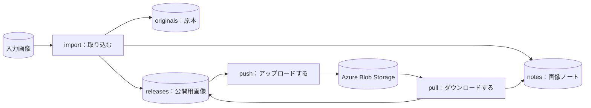

# tkn-azure-blob-note: Tkn Azure Blob Note

画像の原本を手元に保存し、公開用の画像を Azure Blob Storage と同期し、画像ごとの説明や関連を Obsidian の Markdown ノートで管理する CLI です。

たとえば PNG を取り込むと、原本をそのまま保存したうえで、アップロード用の WebP と、説明文・タグ・関連プロジェクトを書き込めるノートを作成します。
アップロードで送信するのは公開用の画像だけです。
ダウンロードでは、Azure に保存されているバイト列をそのまま取得します。
どちらの操作も、コンテナーの匿名公開アクセスを必要としません。

初めて使う場合は、「[1. これは何か](#1-これは何か)」から「[3. 実行する](#3-実行する)」までを上から順に読みます。
「[4. コマンド一覧](#4-コマンド一覧)」以降は、必要になったときに目的の項目を参照します。

## 1. これは何か

### 1.1. 得られる結果の例

`photo.png` を取り込むと、次の3つが作成されます。

| 作成されるもの | 保存先（データ保存領域からの相対パス） | 使い道 |
| --- | --- | --- |
| 原本の写し | `originals/<sha256>/photo.png` | 変換前のバイト列を保持します。変換設定を変えて作り直すときの元になります。 |
| 公開用の画像 | `releases/photo.webp` | Azure Blob Storage へアップロードする画像です。 |
| 画像ノート | `notes/photo.webp.md` | 説明、タグ、関連プロジェクトなどを書き込みます。 |

画像ノートは、次のような Markdown です。
以下は説明用の例で、CLI が管理する項目の一部を省略しています。

```markdown
---
type: image
title: photo
description: 2026年春の展示会で撮影したブースの全景
category: .
tags: [展示会]
nouns: []
domains: []
projects: [spring-exhibition]
assetId: <asset-id>
noteId: <note-id>
url: https://examplestorage.blob.core.windows.net/images/photo.webp
syncStatus: synced
---
# photo

<!-- azure-blob-note:begin -->


[Local image](file:///C:/path/to/data/releases/photo.webp)

[Remote image (access permissions apply)](https://examplestorage.blob.core.windows.net/images/photo.webp)
<!-- azure-blob-note:end -->

ここから下は自由に書けます。
```

`title`、`description`、`tags` などと本文は、利用者が編集する項目です。
`assetId`、`url`、`syncStatus` など、および `azure-blob-note:begin` から `azure-blob-note:end` までのブロックは、CLI が更新します。
CLI は、利用者が編集した項目、独自に追加したプロパティ、ブロック外の本文を保持します。

### 1.2. 対象範囲

| 区分 | 内容 |
| --- | --- |
| 扱うもの | 画像ファイル（`.apng` `.avif` `.bmp` `.gif` `.ico` `.jpg` `.jpeg` `.png` `.svg` `.tif` `.tiff` `.webp`） |
| 自動で変換するもの | 静止画の JPEG と PNG を WebP に変換します。それ以外の形式とアニメーション PNG は、変換せずにコピーします。 |
| 扱わないもの | 画像以外のファイル、動画（WebM への変換を含む） |
| 行わないこと | ストレージ アカウントやコンテナーの作成、アクセス権の変更、独自ドメインや HTTPS の設定、Azure 上の blob の削除、生成 AI による分類 |

主な対象環境は Windows です。

### 1.3. 最初に必要な用語

| 用語 | 意味 |
| --- | --- |
| 原本（original） | 取り込んだ入力ファイルの写しです。取り込み後に編集されることはありません。 |
| 公開用画像（release） | アップロードの対象になる画像です。原本を変換またはコピーして作ります。 |
| 画像ノート | 画像1枚に対応する Markdown ノートです。説明や関連を書き込みます。 |
| アセット | 原本・公開用画像・画像ノートをひとまとめにした管理単位です。変わらない識別子（アセット ID）を持ちます。 |
| 同期の基準（baseline） | 最後に同期が完了した時点の内容の記録です。次回の同期で、手元と Azure のどちらが変わったかを判定するために使います。 |

アセット ID は、ファイル名やノートのタイトルとは独立しています。
ノートのタイトルやカテゴリーを変えても、画像のファイル名、blob 名、URL は変わりません。

### 1.4. 全体像

次の図は、コマンドとデータの関係を示します。
長方形は処理、円筒形はデータです。
矢印はデータの流れを表します。



`import` は手元だけで完結し、Azure へ接続しません。
Azure へ接続するのは、`push`、`pull`、および `--remote` を付けた `status` と `verify` です。
`push` と `pull` は、同期の結果を画像ノートの `syncStatus` にも反映します。

設定と実行時のデータは、このソース リポジトリの外に保存します。
既定の保存先は、ホーム フォルダー配下の `~/.tkn/azure_blob_note/` です。
各フォルダーの役割は「[6. 保存構造](#6-保存構造)」で説明します。

## 2. セットアップ

### 2.1. 前提

- Python 3.11 以降
- [uv](https://docs.astral.sh/uv/)
- Azure と同期する場合：既存のストレージ アカウントとコンテナー、[Azure CLI](https://learn.microsoft.com/cli/azure/install-azure-cli)

取り込み（`import`）、再作成（`build`）、ノートの更新（`notes refresh`）は、Azure の認証なしで実行できます。

### 2.2. インストール

クローンしたリポジトリのフォルダーへ移動し、インストールします。
`C:\path\to\tkn_azure_blob_note` は、実際のフォルダーのパスに置き換えます。

```shell
cd "C:\path\to\tkn_azure_blob_note"
uv tool install .
```

WebP 変換に使う Pillow を含め、必要な Python パッケージは一緒にインストールされます。

インストールできたことを確認します。

```shell
tkn-azure-blob-note --version
```

`tkn-azure-blob-note 0.2.0` のようにバージョンが表示されれば、インストールは完了しています。
コマンドが見つからない場合は、`uv tool update-shell` を実行してから、新しいターミナルを開きます。

コマンドとオプションの一覧は `tkn-azure-blob-note --help` で確認できます。
`--version` と `--help` は、設定や Azure の認証が済んでいなくても表示されます。

### 2.3. 設定ファイルの作成

設定ファイルを作成し、作成先と現在の設定値を確認します。

```shell
tkn-azure-blob-note config init
tkn-azure-blob-note config list
```

`config init` は、`~/.tkn/azure_blob_note/config.yaml` に設定ファイルのひな形を作成し、そのパスを表示します。
`config list` は、有効な設定値と、各値がどの設定ファイルに由来するかを表示します。

### 2.4. 最小限の設定と確認

作成された `config.yaml` を開き、Azure の接続先を設定します。
次は変更する部分の抜粋です。
`schema_version` など、ファイル内の他の設定はそのまま残します。

```yaml
schema_version: "2.0.0"
sources:
  images:
    azure:
      account_url: https://examplestorage.blob.core.windows.net
      container: images
```

`sources.images` が1つの同期対象です。1つのコンテナーに1つの source を設定します。
`azure`、`delivery`、`conversion` と保存先は、すべて `sources.<source-id>` の中に書きます。
既定の source 名は `images` です。

`account_url` と `container` は、実在するストレージ アカウントとコンテナーの値に置き換えます。
編集後にもう一度 `tkn-azure-blob-note config list` を実行し、値が反映されたことを確認します。

Azure と同期する場合は、Azure CLI でサインインします。

```shell
az login
```

サインインした ID には、対象コンテナーに対する blob データの権限が必要です。
アップロードとダウンロードを行う場合は「ストレージ BLOB データ共同作成者」、読み取りだけの場合は「ストレージ BLOB データ閲覧者」が目安です。
詳しくは [Microsoft Entra ID による BLOB へのアクセス承認](https://learn.microsoft.com/azure/storage/blobs/authorize-access-azure-active-directory)を参照します。

認証情報は、このツールの設定ファイルや画像ノートには保存されません。
実行時に `.env` ファイルは読み込みません。
設定項目の一覧と、マネージド ID を使う方法は「[5. 設定](#5-設定)」で説明します。

## 3. 実行する

### 3.1. 最初の実行と結果確認

データを変更するコマンドは、`--dry-run` を付けると、何も変更せずに実行内容だけを表示します。
`--dry-run` の詳しい動作は「[4.1. 共通の動作](#41-共通の動作)」で説明します。

**1. 画像を取り込みます。**

`C:\path\to\photo.png` は、実在する画像のパスに置き換えます。

```shell
tkn-azure-blob-note import "C:\path\to\photo.png"
```

原本が `originals/<sha256>/` に保存され、公開用画像 `releases/photo.webp` と画像ノート `notes/photo.webp.md` が作成されます。
入力したファイルは、削除も移動もされません。
結果は次のような JSON で表示されます（説明用の例）。

```json
{
  "command": "import",
  "source_id": "images",
  "dry_run": false,
  "run_id": "<run-id>",
  "result": [
    {
      "status": "created",
      "path": "photo.webp",
      "source_sha256": "<sha256>",
      "conversion": "webp",
      "asset_id": "<asset-id>"
    }
  ]
}
```

`status` が `created` で、`path` に公開用画像の相対パスが表示されていれば、取り込みは完了しています。
`conversion` は、WebP へ変換した場合は `webp`、変換せずにコピーした場合は `copy` です。

JPEG や PNG を変換せずに取り込むには、`import --no-convert` を使うか、設定で `conversion.enabled: false` を指定します。

**2. アップロードの内容を確認してから、アップロードします。**

```shell
tkn-azure-blob-note push photo.webp --dry-run
tkn-azure-blob-note push photo.webp
```

> [!IMPORTANT]
> `push` は、設定したコンテナーとプレフィックスの範囲へ画像を送信します。
> コンテナーが匿名公開されている場合、アクセス レベルを確認できない場合、コンテナーが `$web` の場合、`delivery.url_base` を設定している場合は、アップロードの前に確認を求めます。
> 対話できない環境（スケジュール実行など）で意図して公開アップロードを行うときは、`--yes` を付けます。

`--dry-run` も Azure に接続し、認証と blob の読み取りを行います。
Azure の読み取り操作には、サービスの料金が発生する場合があります。

**3. Azure 上の画像が手元と一致することを確認します。**

```shell
tkn-azure-blob-note verify --remote
```

表示された JSON の `valid` が `true` であれば、手元の画像、原本、画像ノート、Azure 上の画像に不整合はありません。
`false` の場合は、各項目の `issues` に理由が表示され、終了コードは 2 になります。

**4. Obsidian でノートを開きます（任意）。**

データ保存領域（既定では `~/.tkn/azure_blob_note/data/images`）を Obsidian の Vault として開き、`notes` フォルダーのノートを開きます。
既定の配置では、ノートと手元の画像が同じ Vault に入るため、ノート内に画像が表示されます。
`description`、`tags`、`nouns`、`domains`、`projects` と本文を自由に編集します。

`tkn-azure-blob-note notes refresh` を実行すると、ギャラリー表示用の `notes/images.base`（Obsidian Bases のビュー）が、存在しない場合に作成されます。

既存の Vault に組み込む方法は「[5.2. 既存の Vault にノートを置く](#52-既存の-vault-にノートを置く)」で説明します。

### 3.2. 日常の利用

```shell
# フォルダーを取り込む。フォルダー内の相対的な階層を保つ。
tkn-azure-blob-note import "C:\path\to\images"

# 引数を省略すると、データ保存領域の staging フォルダーを取り込む。
tkn-azure-blob-note import

# 手元の状態を確認する。--remote を付けると Azure とも比較する。
tkn-azure-blob-note status
tkn-azure-blob-note status --remote

# 設定した範囲の管理対象画像をすべて転送する。
tkn-azure-blob-note push
tkn-azure-blob-note pull

# 変換設定を変えた後、保存してある原本から公開用画像を作り直す。
tkn-azure-blob-note build

# ノートの自動生成項目（メタデータ、URL、手元の画像へのリンク）を更新する。
tkn-azure-blob-note notes refresh

# 手元のハッシュ値とノートの識別子を検査する。
tkn-azure-blob-note verify
```

取り込みを繰り返したときの動作は、次のとおりです。

| 状況 | 動作 |
| --- | --- |
| 同じ名前・同じ内容・同じ変換設定で再度取り込む | 何も変更せず、`unchanged` を返します。 |
| 同じ名前で内容が異なる | 停止します。`--name` で別の名前を指定します。 |
| 同じ名前・同じ内容で、変換設定だけが変わっている | 停止します。`build` で作り直します。 |

`--name photos/another.png` のように指定すると、入力が1枚のときに限り、公開用画像の相対パスを変更できます。
WebP へ変換される場合、拡張子は `.webp` に置き換わります。

画像ノートは、`notes_root` の中であれば名前の変更や移動ができます。
CLI は、ノートに記録された ID で対応するノートを見つけます。

### 3.3. 手元と Azure の内容が食い違ったとき

`push` と `pull` は、同期の基準と比較して、手元と Azure のどちらが変わったかを判定します。
両方が変わっている場合や、同期の記録がない転送先に異なる内容がある場合は、何も転送せずに停止します。

両方の内容を確認したうえで、残す側に応じたコマンドに `--overwrite` を付けます。
次は、Azure 側の内容で手元を置き換える例です。

```shell
tkn-azure-blob-note pull photo.webp --overwrite --dry-run
tkn-azure-blob-note pull photo.webp --overwrite --yes
```

> [!WARNING]
> `--overwrite` は、コマンドの方向に沿って転送先の内容を置き換えます。
> `pull --overwrite` で置き換えられる手元の画像は、事前に `history` フォルダーへ退避されます。
> `push --overwrite` で置き換えた Azure 側の内容を元に戻せるかどうかは、Azure のバージョン管理やバックアップの設定に依存します。この CLI は、それらを有効にしません。

`--yes` は確認を省略するためのオプションで、内容の食い違いは解決しません。
食い違いの解決には、必ず `--overwrite` を指定します。

同期コマンドは、片方にしかない画像を削除しません。
同期済みの画像が Azure 側で削除されていた場合、`push` は自動では再作成せずに停止します。
再作成するには `--overwrite` を付けます。

`pull` が既存のアセットを Azure 側の内容で置き換えると、そのアセットは原本との対応を失います。
ノートの `sourceAvailable` は `false` になり、以後 `build` の対象から外れます。
`originals` に保存済みの原本ファイルは削除されません。

### 3.4. 途中で失敗したとき

ファイル1つずつの書き込みは、途中の状態を残さない方法で行います。
ただし、複数の画像を扱う1回の実行全体は、まとめて取り消されません。
途中で失敗した場合、完了済みの画像は処理された状態で残ります。

次の順で状態を確認し、復旧します。

```shell
tkn-azure-blob-note verify
tkn-azure-blob-note recover --dry-run
tkn-azure-blob-note recover
tkn-azure-blob-note verify
```

`recover` は、公開用画像の書き込みまで終わっていて、カタログとノートの更新だけが残っている処理を完了させます。
記録された内容と一致する画像が手元にある場合だけ復旧し、Azure への書き込みは行いません。
復旧後に、失敗したコマンドをもう一度実行します。
アップロードが中断していた場合、再実行時に Azure 上の内容を読み取って比較し、一致していればアップロード済みとして扱います。

実行ごとの記録の保存先は「[6. 保存構造](#6-保存構造)」を参照します。

## 4. コマンド一覧

アセットを指定する引数（`ASSET`）には、アセット ID または公開用画像の相対パス（例：`photo.webp`）を指定します。
省略すると、管理しているすべてのアセットが対象になります。
`pull` で省略した場合は、設定した範囲にある、対応形式のすべての画像が対象になります。

| 目的 | コマンド | 通信 | 変更するもの |
| --- | --- | --- | --- |
| 設定ファイルを作成する | `config init [--path FILE] [--force]` | なし | 設定ファイル。`--force` は、編集済みのファイルをバックアップしてから置き換えます。 |
| 有効な設定を確認する | `config list [--json]` | なし | なし |
| 画像を取り込む | `import [PATH ...] [--name PATH] [--no-convert]` | なし | 原本、公開用画像、ノート、実行記録 |
| 公開用画像を作り直す | `build [ASSET ...]` | なし | 公開用画像、`history`、ノート、実行記録 |
| アップロードする | `push [ASSET ...] [--overwrite] [--yes]` | Azure の読み取りと書き込み | Azure 上の blob、同期の基準、ノート、実行記録 |
| ダウンロードする | `pull [ASSET ...] [--overwrite] [--yes]` | Azure の読み取り | 公開用画像、`history`、同期の基準、ノート、実行記録 |
| ノートの自動生成項目を更新する | `notes refresh [ASSET ...]` | なし | ノート、カタログ、実行記録 |
| 状態を確認する | `status [--remote]` | `--remote` のとき Azure の一覧取得 | なし |
| 整合性を検査する | `verify [--remote]` | `--remote` のとき Azure から内容を読み取り | なし |
| 中断した処理を完了させる | `recover` | なし | カタログ、ノート、実行記録 |

各コマンドの引数とオプションは、`tkn-azure-blob-note <command> --help` で確認できます。

### 4.1. 共通の動作

**source の選択**

source が1つなら自動で選びます。複数ある場合、データを扱うすべてのコマンドに
`--source <id>` を指定します。アセットの省略は、その source 内の全アセットを意味します。

```shell
tkn-azure-blob-note import --source images "C:\path\to\photo.png"
tkn-azure-blob-note push --source images --dry-run
tkn-azure-blob-note status --source images
```

`--source` はサブコマンドの前後どちらにも書けます。
`config list` は全 source の設定を表示し、`--source` を付けると選択した名前も表示します。
処理結果の JSON の `source_id` で、対象を確認できます。

**`--dry-run`**

`config init`、`import`、`build`、`push`、`pull`、`notes refresh`、`recover` で使えます。
`status`、`verify`、`config list` は、もともと何も変更しません。

| 項目 | `--dry-run` での動作 |
| --- | --- |
| データ、ノート、同期の基準、実行記録、ログ | 作成も変更もしません。 |
| 画像の変換 | 行いません。 |
| Azure への書き込み | 行いません。 |
| Azure の認証と読み取り（`push` と `pull`） | 行います。比較のために blob の内容を読み取ることがあり、Azure の料金が発生する場合があります。 |

Azure の認証ライブラリは、このツールの保存領域の外に、独自のトークン キャッシュを保持することがあります。

**出力**

処理結果は、標準出力に JSON で表示します。
`config list` だけは `キー=値` の形式で表示し、`--json` を付けると JSON になります。
進行状況やエラーなどのメッセージは、標準エラー出力に表示します。
`--quiet` はメッセージをエラーだけに絞り、`--verbose` は詳細なメッセージを加えます。
この2つは同時に指定できません。

**終了コード**

| 終了コード | 意味 |
| --- | --- |
| 0 | 成功 |
| 2 | 入力や引数の誤り、内容の食い違い、検査の失敗 |
| 3 | Azure への要求の失敗 |

**保存先を一時的に変えるオプション**

すべてのコマンドで、`--config`、`--data-root`、`--state-root`、`--notes-root` を指定できます。
これらはサブコマンドの前後どちらにも書けます。

### 4.2. `status --remote` の結果の読み方

| 項目 | 値 | 意味 |
| --- | --- | --- |
| `local` | `valid` | 手元の画像が、記録と一致しています。 |
| | `modified` | 手元の画像が、CLI を通さずに変更されています。 |
| | `missing` | 手元に画像がありません。 |
| `remote` | `unchanged` | Azure 側は、最後の同期から変わっていません。 |
| | `changed` | Azure 側が、最後の同期の後に変更されています。 |
| | `untracked` | Azure 側に同名の blob がありますが、同期の記録がありません。 |
| | `missing` | Azure 側に blob がありません。 |
| | `remote_only` | Azure 側だけにあり、手元で管理していません。 |
| `local_since_sync` | `unchanged` / `changed` | 手元の画像が、最後の同期から変わっているかどうかです。 |
| | `unknown` | 同期の記録がありません。 |

`remote` と `local_since_sync` は、`--remote` を付けたときだけ表示されます。

## 5. 設定

### 5.1. 最初に変更する項目

次のキーは、すべて `sources.<source-id>.` 以下に書きます。

| 設定キー | 既定値 | 変更すると変わること |
| --- | --- | --- |
| `azure.account_url` | `null` | 同期先のストレージ アカウントです。Azure に接続するコマンドで必須です。 |
| `azure.container` | `null` | 同期先のコンテナーです。Azure に接続するコマンドで必須です。 |
| `azure.prefix` | 空 | コンテナー内の、同期の対象とするフォルダーです。 |
| `azure.auth` | `azure_cli` | 認証方法です。Azure 上で実行する場合は `managed_identity` を選べます。 |
| `delivery.url_base` | `null` | ノートの `url` に書き込む配信 URL の起点です。未設定の場合は blob 本来の URL を使います。 |
| `conversion.enabled` | `true` | JPEG と PNG を WebP に変換するかどうかです。 |
| `notes_root` | `null` | 画像ノートの保存先です。未設定の場合は `<data_root>/notes` です。 |

非公開の画像では、`delivery.url_base` を設定せず、ノート内の手元の画像へのリンクを使います。
`delivery.url_base` は URL を組み立てるだけの設定です。
指定する URL は、設定した blob の範囲をすでに配信している必要があります。

すべての設定キー、既定値、設定ファイルの優先順位、相対パスの基準は、[設定とデータの取り決め](docs/reference/contracts.md)にまとめています。

### 5.2. 既存の Vault にノートを置く

`notes_root` に、既存の Vault 内のフォルダーを指定します。
次は設定ファイルの抜粋です。

```yaml
sources:
  images:
    notes_root: 'C:\path\to\vault\images'
```

この場合、ノートから手元の画像への参照は `file:///` 形式の URI になります。
Obsidian 上で画像がプレビュー表示されるかどうかは、利用環境に依存します。
確実にプレビューを表示したい場合は、公開用画像とノートを同じ Vault の中に置きます。

この CLI は、プラグインのインストール、ジャンクションの作成、添付ファイルの自動複製を行いません。

### 5.3. 複数のコンテナーを管理する

次は、同じアカウント内の2つのコンテナーを、別々の source として管理する設定です。
`delivery` と `conversion` は source ごとに変えられます。

```yaml
schema_version: "2.0.0"
sources:
  images:
    azure:
      account_url: https://examplestorage.blob.core.windows.net
      container: images
    delivery:
      url_base: https://images.example.com
    conversion:
      enabled: true
      quality: 82
  private-images:
    azure:
      account_url: https://examplestorage.blob.core.windows.net
      container: private-images
    conversion:
      enabled: false
```

保存先を省略した場合、`images` は `~/.tkn/azure_blob_note/data/images/`、
`private-images` は `~/.tkn/azure_blob_note/data/private-images/` に保存されます。
同期記録とログも `~/.tkn/azure_blob_note/state/<source-id>/` に分かれます。

```shell
tkn-azure-blob-note import --source private-images "C:\path\to\photo.png"
tkn-azure-blob-note pull --source private-images --dry-run
```

設定ファイルを重ねる場合、後のファイルの `sources` は前の一覧全体を置き換えます。
同じアカウントの同じコンテナーを、異なる source に重複登録することはできません。
`azure.prefix` が違っていても同じです。

旧形式（`schema_version: "1.0.x"`）の設定は、読み込み時に `images` として扱います。
従来の保存先と同期記録を保持し、設定や実データは書き換えません。
新形式に手動で書き直して既存データを使う場合は、
`data_root` と `state_root` に従来の保存先を明示してください。
新規 source の既定値は `<source-id>` を含む別の保存先になります。

## 6. 保存構造

既定では、`~/.tkn/azure_blob_note/` の下に次のように保存します。
保存先は source ごとの `data_root`、`state_root`、`notes_root` で変更できます。

| 保存先 | 保存するもの | 失った場合 |
| --- | --- | --- |
| `config.yaml` | 利用者の設定 | `config init` で作り直し、設定をやり直します。 |
| `data/<source-id>/staging/` | 取り込み待ちの画像を置く場所（任意）。引数なしの `import` が読み取ります。 | 影響はありません。 |
| `data/<source-id>/originals/<sha256>/` | 取り込んだ原本。変更されません。 | 再作成できません。`build` で作り直せなくなります。 |
| `data/<source-id>/releases/` | blob 名に対応する、現在の公開用画像 | 同期済みであれば `pull` で復元できます。 |
| `data/<source-id>/notes/` | 画像ノートと Obsidian Bases のビュー | 利用者が書いた説明と本文は再作成できません。 |
| `data/<source-id>/catalog/` | アセット ID と、ファイル同士の対応 | アセット ID と、原本との対応を失います。 |
| `data/<source-id>/provenance/` | 失敗したものを含む、処理の記録 | `recover` で復旧できなくなります。 |
| `data/<source-id>/history/<sha256>/` | 置き換える前の公開用画像 | 置き換え前の内容に戻せなくなります。 |
| `state/<source-id>/` | 同期の基準、実行ごとの記録（`runs`）、ログ（`logs`） | 同期の基準を失うと、次回の同期で内容の比較からやり直します。 |

バックアップでは、`data` と `state` の全体、および `notes_root` を外に置いている場合はそのフォルダーを対象にします。
`history` と `originals` は、独立したバックアップの代わりにはなりません。

ファイルの形式、識別子、同期の判定規則は、[設定とデータの取り決め](docs/reference/contracts.md)で説明します。

## 7. 対応範囲と制限

- 画像だけを管理します。汎用のファイルや動画は扱いません。
- Azure 上の blob を削除しません。また、公開済みの blob 名を自動で変更しません。
- 保存期間の管理や、古いデータの自動削除は行いません。
- 生成 AI のサービスを呼び出しません。
- RDF データベースは持ちません。処理の記録は、将来のグラフ形式への書き出しに使える構造で保存しています。
- 同期は、更新日時だけで内容が同じだと判断しません。必要に応じて内容を読み取り、ハッシュ値で比較します。
- ノートの `syncStatus: synced` は、最後に完了した転送の記録です。現在の Azure の状態は、`status --remote` または `verify --remote` で確認します。

## 8. 更新と保守

ソース、同梱ファイル、依存パッケージを更新した後は、再インストールします。

```shell
cd "C:\path\to\tkn_azure_blob_note"
uv tool install . --reinstall
tkn-azure-blob-note --version
```

リポジトリのフォルダーを移動または改名した後も、新しい場所で同じ再インストールを実行します。
uv が記録しているソースのパスが更新されます。
コマンド名と、`~/.tkn/azure_blob_note/` の保存領域は変わりません。

変更履歴は [CHANGELOG.md](CHANGELOG.md) を参照します。

## 9. 開発と検証

```shell
cd "C:\path\to\tkn_azure_blob_note"
uv sync --locked
uv run pytest
uv run ruff check .
uv run mypy src
uv build
```

> [!NOTE]
> テストは、一時フォルダーのデータと、Blob Storage を模した処理を使います。
> 実際のストレージ アカウントには書き込まないため、Azure との実接続の動作はテストでは保証されません。

- パッケージは `src` レイアウトで、ノートと設定のひな形を wheel と sdist に含めます。インストール後の実行は、このリポジトリのフォルダーに依存しません。
- ソースの変更をすぐに反映したい場合は、`uv tool install -e . --reinstall` で editable インストールにします。
- リポジトリのフォルダーを移動または改名した場合は、開発環境でも `uv sync --locked` を実行します。editable インストールが、ソースの絶対パスを保持しているためです。
- 個人の設定、ノート、画像、調査の記録はコミットに含めません。

## 10. 関連ドキュメント

- [設定とデータの取り決め](docs/reference/contracts.md)：すべての設定キー、ノートとカタログの形式、同期と競合の判定規則、処理の記録とバックアップ
- [CHANGELOG.md](CHANGELOG.md)：バージョンごとの変更内容
