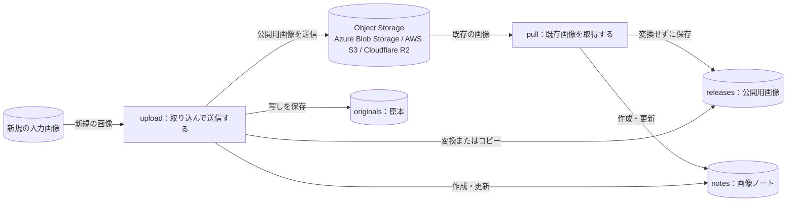
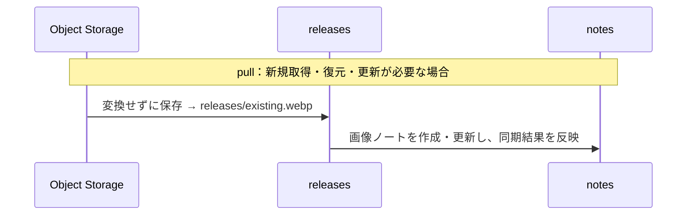
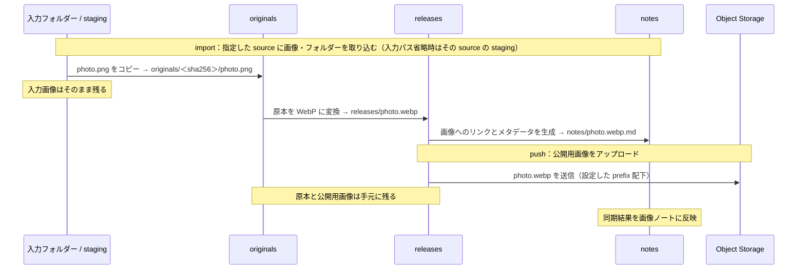
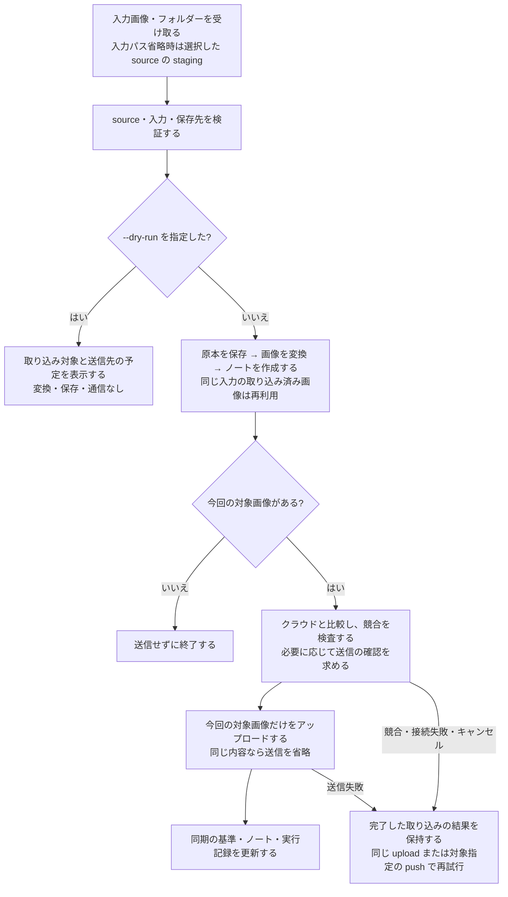
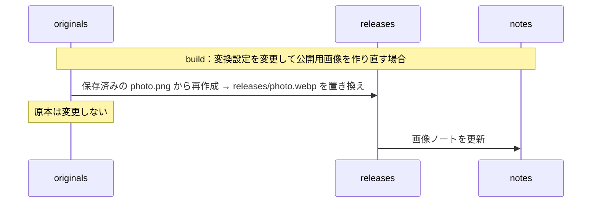
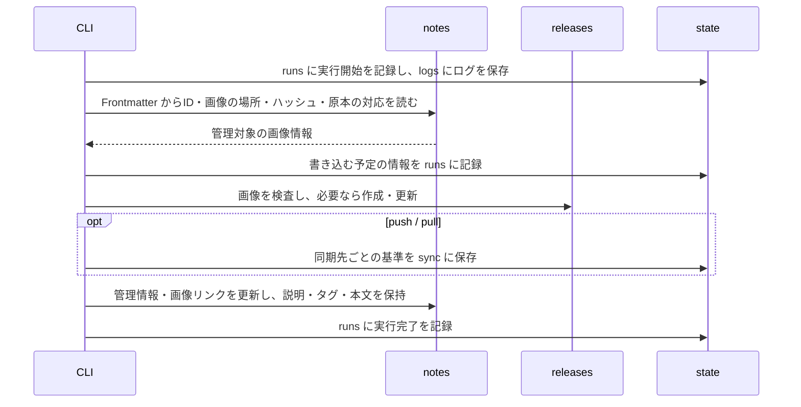

# tkn-objstorage-imgcatalog: Tkn Object Storage Image Catalog

Azure Blob Storage・AWS S3・Cloudflare R2 に置く画像を、手元の原本・公開用画像・Obsidian で読める Markdown ノートと対応付けて管理する CLI です。
たとえば PNG を `upload` すると、原本をそのまま保存したうえで、公開用の WebP を作成してクラウドへ送信し、説明文やタグを書き込める画像ノートを作成します。
すでにクラウドにある画像は、`pull` で手元に取得し、同じように画像ノートを作成します。

1つのコンテナーまたはバケットを1つの接続先（source）として登録し、接続先ごとに1つの Obsidian Vault を持つ想定です。
ダウンロードでは、クラウドに保存されているバイト列をそのまま取得します。
アップロードとダウンロードのどちらも、コンテナーやバケットの匿名公開アクセスを必要としません。

初めて使う場合は、「[1. これは何か](#1-これは何か)」から「[4. 実行する](#4-実行する)」までを上から順に読みます。
「[5. コマンド一覧](#5-コマンド一覧)」以降は、必要になったときに目的の項目を参照します。

## 1. これは何か

### 1.1. 得られる結果の例

新規画像の `photo.png` を `upload` すると、次の3つが手元に作成され、公開用画像がクラウドへ送信されます。

| 作成されるもの | 保存先（データ保存領域からの相対パス） | 使い道 |
| --- | --- | --- |
| 原本の写し | `originals/<sha256>/photo.png` | 変換前のバイト列を保持します。変換設定を変えて作り直すときの元になります。 |
| 公開用の画像 | `releases/photo.webp` | 選択した Object Storage へアップロードする画像です。 |
| 画像ノート | `notes/photo.webp.md` | 説明、タグ、関連プロジェクトなどを書き込みます。 |

画像ノートは、次のような Markdown です。
以下は説明用の例で、CLI が管理する項目の一部を省略しています。

```markdown
---
type: image
schemaVersion: "3.0.0"
title: "photo.webp"
description: 2026年春の展示会で撮影したブースの全景
cover: "releases/photo.webp"

# --- Asset identity ---
assetId: <asset-id>

# --- Storage and synchronization ---
url: https://examplestorage.blob.core.windows.net/images/photo.webp
syncStatus: synced

tags: [展示会]
created: "2026-10-06T09:00:00+09:00"
updated: "2026-10-06T09:00:00+09:00"
noteId: <note-id>
---

# photo.webp

<!-- object-storage-catalog:begin -->


[Local image](file:///C:/path/to/data/releases/photo.webp)

[Remote image (access permissions apply)](https://examplestorage.blob.core.windows.net/images/photo.webp)
<!-- object-storage-catalog:end -->

ここから下は自由に書けます。
```

ノートの各部分は、利用者と CLI のどちらが書くかが決まっています。

| 部分 | 書く人 | CLI が更新するときの扱い |
| --- | --- | --- |
| `title`、`description`、`tags`、独自に追加したプロパティ、ブロックの外の本文 | 利用者 | 保持します。 |
| `assetId`、`url`、`syncStatus` などの管理項目 | CLI | 現在の状態に合わせて書き換えます。 |
| `object-storage-catalog:begin` から `object-storage-catalog:end` までのブロック | CLI | ブロック全体を置き換えます。 |

`created` はノートを新規作成した日時、`updated` は CLI がノートの Frontmatter または本文を実際に変更した日時です。
内容が変わらない実行、確認だけのコマンド、`--dry-run` では `updated` を更新しません。
Obsidian などで手動編集したときの `updated` は、利用者またはエディター側で更新します。
項目ごとの担当と日時の意味は、[ノートの項目の担当](docs/reference/contracts.md#32-ノートの項目の担当)にまとめています。

### 1.2. 対象範囲

| 区分 | 内容 |
| --- | --- |
| 扱うもの | 画像ファイル（`.apng` `.avif` `.bmp` `.gif` `.ico` `.jpg` `.jpeg` `.png` `.svg` `.tif` `.tiff` `.webp`） |
| 自動で変換するもの | 静止画の JPEG と PNG を WebP に変換します。それ以外の形式とアニメーション PNG は、変換せずにコピーします。 |
| 扱わないもの | 画像以外のファイル、動画（WebM への変換を含む） |
| 行わないこと | ストレージ アカウント・コンテナー・バケットの作成、アクセス権の変更、独自ドメインや HTTPS の設定、クラウド上のオブジェクトの削除、生成 AI による分類 |

主な対象環境は Windows です。
サービスごとの上限や対象外の構成は「[8. 対応範囲と制限](#8-対応範囲と制限)」にまとめています。

### 1.3. 最初に必要な用語

| 用語 | 意味 |
| --- | --- |
| 接続先（source） | 1つのコンテナーまたはバケットに対応する設定です。利用者が付けた名前（source ID）を、コマンドの `--source` で指定します。 |
| データ保存領域（`data_root`） | 接続先ごとに、原本・公開用画像・画像ノートを保存するフォルダーです。Obsidian では、このフォルダーを Vault として開きます。 |
| 原本（original） | 取り込んだ入力ファイルの写しです。取り込み後に編集されることはありません。 |
| 公開用画像（release） | アップロードの対象になる画像です。原本を変換またはコピーして作るほか、`pull` でクラウドから取得します。 |
| 画像ノート | 画像1枚に対応する Markdown ノートです。説明や関連を書き込みます。 |
| アセット | 原本・公開用画像・画像ノートをひとまとめにした管理単位です。変わらない識別子（アセット ID）を持ちます。 |
| 同期の基準（baseline） | 最後に同期が完了した時点の内容の記録です。次回の同期で、手元とクラウドのどちらが変わったかを判定するために使います。 |

アセット ID は、ファイル名やノートのタイトルとは独立しています。
ノートのタイトルを変えても、画像のファイル名、オブジェクトキー、URL は変わりません。

### 1.4. 全体像

次の図は、主要な2つのコマンドとデータの関係を示します。
長方形は処理、円筒形はデータです。
矢印はデータの流れを表し、ラベルはそのデータに行う操作です。
Object Storage は、`pull` の取得元であり、`upload` の送信先でもあります。



既存の Object Storage を使う場合は、`pull` で既存画像を手元に反映してから、新規画像を `upload` で追加します。
取り込みと送信を分けたい場合は、`upload` の代わりに `import`（取り込み）と `push`（送信）を順に使います。

クラウドへ接続するのは、`upload`、`push`、`pull`、および `--remote` を付けた `status` と `verify` です。
`import`、`build`、`notes refresh` などは手元だけで完結します。

設定と実行時のデータは、このソース リポジトリの外に保存します。
既定の保存先は、ホーム フォルダー配下の `~/.tkn/objstorage-imgcatalog/` です。
各フォルダーの役割と、コマンドごとの詳しいデータの流れは「[7. 保存構造とデータの流れ](#7-保存構造とデータの流れ)」で説明します。

## 2. クイックスタート

Azure Blob Storage に既存のコンテナーがあり、Azure CLI でサインイン済み（`az login`）の場合の最短手順です。
AWS S3・Cloudflare R2 を使う場合や、各手順の意味を確認したい場合は、「[3. セットアップ](#3-セットアップ)」から読みます。
`C:\path\to\...` と `my-obj-storage-1`（設定ファイルのひな形に入っている source ID）は、実際の値に置き換えます。

```shell
# 1. リポジトリのフォルダーでインストールし、バージョンが表示されることを確認する
cd "C:\path\to\tkn_objstorage_imgcatalog"
uv tool install .
tkn-objstorage-imgcatalog --version

# 2. 設定ファイルのひな形を作成する
#    表示された path のファイルを開き、azure.account_url と azure.container を設定する
tkn-objstorage-imgcatalog config init

# 3. クラウドの既存画像の取得予定を確認してから、手元に取得する
tkn-objstorage-imgcatalog pull --source my-obj-storage-1 --dry-run
tkn-objstorage-imgcatalog pull --source my-obj-storage-1

# 4. 新規画像を取り込んでアップロードする
tkn-objstorage-imgcatalog upload --source my-obj-storage-1 "C:\path\to\photo.png"

# 5. 手元とクラウドの内容が一致することを検査する
tkn-objstorage-imgcatalog verify --source my-obj-storage-1 --remote
```

手順5で表示される JSON の `valid` が `true` であれば完了です。
画像とノートは `~/.tkn/objstorage-imgcatalog/data/my-obj-storage-1/` に保存されます。

> [!IMPORTANT]
> 手順3〜5はクラウドへ接続し、各サービスの API 利用・転送の料金が発生する場合があります。
> 手順4は公開用画像をクラウドへ送信します。公開されている、または公開状態を判定できない送信先では、送信前に確認を求めます。

## 3. セットアップ

### 3.1. 前提

- Python 3.11 以降
- [uv](https://docs.astral.sh/uv/)
- Object Storage と同期する場合：既存のコンテナーまたはバケットと、読み書きできる認証情報
- Azure CLI 認証を使う場合：[Azure CLI](https://learn.microsoft.com/cli/azure/install-azure-cli)
- AWS S3 / Cloudflare R2：AWS SDK が読み取れる認証プロファイルまたは環境変数。AWS CLI はプロファイル設定用に利用できます。

取り込み（`import`）、再作成（`build`）、ノートの更新（`notes refresh`）は、クラウドの認証なしで実行できます。

### 3.2. インストール

クローンしたリポジトリのフォルダーへ移動し、インストールします。
`C:\path\to\tkn_objstorage_imgcatalog` は、実際のフォルダーのパスに置き換えます。

```shell
cd "C:\path\to\tkn_objstorage_imgcatalog"
uv tool install .
```

WebP 変換に使う Pillow を含め、必要な Python パッケージは一緒にインストールされます。

インストールできたことを確認します。

```shell
tkn-objstorage-imgcatalog --version
```

`tkn-objstorage-imgcatalog 0.11.1` のようにバージョンが表示されれば、インストールは完了しています。
コマンドが見つからない場合は、`uv tool update-shell` を実行してから、新しいターミナルを開きます。

コマンドとオプションの一覧は `tkn-objstorage-imgcatalog --help` で確認できます。
`--version` と `--help` は、設定やクラウドの認証が済んでいなくても表示されます。

### 3.3. 設定ファイルの作成

設定ファイルを作成し、作成先と現在の設定値を確認します。

```shell
tkn-objstorage-imgcatalog config init
tkn-objstorage-imgcatalog config list
```

`config init` は、`~/.tkn/objstorage-imgcatalog/config.yaml` に設定ファイルのひな形を作成し、そのパスを JSON の `path` に表示します。
`config list` は、有効な設定値と、各値がどの設定ファイルに由来するかを表示します。

### 3.4. 接続先と認証の設定

作成された `config.yaml` を開き、source の `provider` と、対応する接続設定を変更します。
以下は、接続先ごとの設定ファイル全体の例で、それぞれ単独で使える最小構成です。
`my-obj-storage-1` は任意の source ID です。URL、コンテナー名、バケット名、プロファイル名は実際の値に置き換えます。
画像の変換・保存先・配信 URL は、接続先によらず同じ設定キーを使います。

**Azure Blob Storage**

```yaml
schema_version: "4.0.0"
sources:
  my-obj-storage-1:
    provider: azure
    azure:
      account_url: https://examplestorage.blob.core.windows.net
      container: images
```

Azure CLI でサインインします。

```shell
az login
```

読み書きには対象コンテナーへの「ストレージ BLOB データ共同作成者」、読み取りだけなら「ストレージ BLOB データ閲覧者」が目安です。
[Microsoft Entra ID による BLOB へのアクセス承認](https://learn.microsoft.com/azure/storage/blobs/authorize-access-azure-active-directory)も参照してください。
Azure 上で実行する場合は、`azure.auth: managed_identity` も選べます。

**AWS S3**

```yaml
schema_version: "4.0.0"
sources:
  my-obj-storage-1:
    provider: s3
    s3:
      bucket: example-images
      region: ap-northeast-1
      profile: images
```

`profile` は、AWS の共有設定・認証情報に登録したプロファイル名です。
たとえば AWS CLI の `aws configure --profile images` で設定します。
IAM Identity Center の場合は、設定済みのプロファイルで `aws sso login --profile images` を実行します。
`profile` を省略すると、環境変数やロールなど、Boto3 の標準の認証情報探索を使います。

読み取りには対象バケットの `s3:ListBucket` と対象オブジェクトの `s3:GetObject`、アップロードには加えて `s3:PutObject` が必要です。
SSE-KMS を使うバケットでは KMS の権限も必要です。
詳細は [Boto3 の認証情報](https://docs.aws.amazon.com/boto3/latest/guide/credentials.html)を参照してください。

**Cloudflare R2**

```yaml
schema_version: "4.0.0"
sources:
  my-obj-storage-1:
    provider: r2
    s3:
      bucket: example-images
      endpoint_url: https://0123456789abcdef0123456789abcdef.r2.cloudflarestorage.com
      region: auto
      profile: r2-images
    delivery:
      url_base: https://images.example.com
```

`endpoint_url` は、Cloudflare が表示するアカウントの S3 API エンドポイントに置き換えます。
EU / FedRAMP の管轄別エンドポイントにも対応します。
R2 の Access Key ID / Secret Access Key を `r2-images` プロファイルに設定します（例：`aws configure --profile r2-images`）。
通常の Cloudflare API トークンを、そのまま S3 のキーとして指定することはできません。
認証情報には、対象バケットのオブジェクト読み書き権限が必要です。
[Cloudflare の Boto3 利用例](https://developers.cloudflare.com/r2/examples/aws/boto3/)を参照してください。

`delivery.url_base` は任意です。画像を配信する場合だけ、設定済みの独自ドメインなどを指定します。
R2 の S3 API エンドポイントはブラウザー向けの配信 URL として使えないため、未設定ではノートの `url` が `null` になり、手元の画像へのリンクを使います。

**設定の確認**

```shell
tkn-objstorage-imgcatalog config list
```

変更した値が表示されれば、設定は読み込まれています。
接続と権限は、最初の `pull --dry-run` または `upload` で確認されます。

- 認証情報は、この CLI の YAML・画像ノート・実行記録には保存しません。`.env` ファイルも読み込みません。
- S3 と R2 は同じ `s3` 設定ブロックを使います。`provider` に対応する接続設定だけが使用されます。
- 接続先を変えると、同期の履歴は接続先ごとに分かれます。手元のファイルは自動では移動されません。

## 4. 実行する

### 4.1. 最初の実行と結果確認

既存の Object Storage を使う場合は、まず `pull` で現在の画像を手元に反映し、その後、新規画像を `upload` で追加します。
まだクラウドに画像がない場合は、手順2から始められます。
以下の例の `my-obj-storage-1` は、設定した source ID に置き換えます。
source が1件でも、`--source` の指定が必要です。

**1. クラウド上の既存画像を手元に反映します。**

まず取得予定を確認し、続けて実際に取得します。

```shell
tkn-objstorage-imgcatalog pull --source my-obj-storage-1 --dry-run
tkn-objstorage-imgcatalog pull --source my-obj-storage-1
```

対象は、設定したコンテナー／バケットのうち、prefix で指定した範囲にある対応形式の画像です。
prefix が空なら、コンテナー／バケット全体の対応画像が対象です。
`pull --dry-run` はクラウドに接続して比較しますが、手元には書き込みません。

たとえばクラウドに `travel/kyoto/existing.webp` がある場合（prefix 設定時はその配下）、次のように保存します。

| 保存先 | 取得結果 |
| --- | --- |
| 手元の公開用画像 | `<data_root>/releases/travel/kyoto/existing.webp` |
| 画像ノート | `<data_root>/notes/travel/kyoto/existing.webp.md` |

画像は変換せずに取得し、クラウド上の画像は変更しません。
`originals` に原本は作成されないため、取得した画像は `build`（原本からの作り直し）の対象になりません。
既存の手元の画像と競合した場合は停止します。「[4.3. 手元とクラウドの内容が食い違ったとき](#43-手元とクラウドの内容が食い違ったとき)」を参照してください。
新規画像を追加しない場合は、手順3の確認へ進みます。

**2. 新規画像を取り込んで、そのままアップロードします。**

`upload` は、原本の保存・画像の変換・ノートの作成から、クラウドへの送信までを1コマンドで実行します。

```shell
tkn-objstorage-imgcatalog upload --source my-obj-storage-1 "C:\path\to\photo.png" --name travel/kyoto/photo.webp
```

入力パスは、実在する新規画像の場所に置き換えます。
`--name` は入力が1枚のときに使え、公開用画像の保存先を相対パスで指定します。
入力側に `travel/kyoto` のフォルダーを作る必要はありません。
既存画像と重複しない保存先を指定してください。この例では、`travel/kyoto/photo.webp` がまだ存在しないものとします。
`--name` を省略すると、入力のファイル名（WebP に変換する場合は拡張子を `.webp` に置き換えた名前）で保存します。

WebP 変換が有効な場合（既定）、次の画像とノートが作成されます。

| 保存先 | この例の結果 |
| --- | --- |
| 手元の原本 | `<data_root>/originals/<sha256>/photo.png` |
| 手元の公開用画像 | `<data_root>/releases/travel/kyoto/photo.webp` |
| 画像ノート | `<data_root>/notes/travel/kyoto/photo.webp.md` |
| クラウドのコンテナー／バケット | `travel/kyoto/photo.webp`。prefix 設定時は `<prefix>/travel/kyoto/photo.webp` |

入力ファイルは削除も移動もされません。
送信対象は、今回の入力に対応する画像だけです。

> [!IMPORTANT]
> 公開されている、または公開状態を判定できない送信先へのアップロードでは、送信前に確認を求めます。
> Azure では匿名公開・公開状態不明・`$web` コンテナー・配信 URL 設定済みの場合、S3/R2 では変更を伴うアップロードが該当します。
> 対話できない環境で意図して送信するときは、`--yes` を付けます。

結果は次のような JSON で表示されます。
新規画像を取り込んで送信した場合の説明用の例です。

```json
{
  "command": "upload",
  "source_id": "my-obj-storage-1",
  "dry_run": false,
  "run_id": "<run-id>",
  "result": {
    "import": [
      {
        "status": "created",
        "path": "travel/kyoto/photo.webp",
        "source_sha256": "<sha256>",
        "conversion": "webp",
        "asset_id": "<asset-id>"
      }
    ],
    "upload": [
      {
        "asset_id": "<asset-id>",
        "path": "travel/kyoto/photo.webp",
        "status": "created"
      }
    ]
  }
}
```

`result.import` が取り込みの結果、`result.upload` がクラウドへの送信の結果です。
上の例では両方が `created` なので、取り込みと新規アップロードが完了しています。
同じ入力で再実行すると取り込み済みの画像を再利用し、クラウドにも同じ内容があれば、送信の結果は `unchanged` になります。

実行前に取り込み対象と送信先の予定を確認したい場合は、同じコマンドに `--dry-run` を付けます。

```shell
tkn-objstorage-imgcatalog upload --source my-obj-storage-1 "C:\path\to\photo.png" --name travel/kyoto/photo.webp --dry-run
```

`upload --dry-run` は、変換・保存・クラウド接続を行いません。
送信の結果に表示される `pending_remote_check` は、クラウドとの比較が未実施であることを示します。
権限、クラウド側との競合、変換結果は、通常の実行時に検証します。

送信の失敗や確認のキャンセルがあっても、完了した取り込みの結果は手元に残ります。
同じ `upload`、または対象を指定した `push` で再試行できます。
処理の分岐は「[upload の処理の流れ](#upload-の処理の流れ)」の図で確認できます。

**3. クラウド上の画像が手元と一致することを確認します。**

```shell
tkn-objstorage-imgcatalog verify --source my-obj-storage-1 --remote
```

表示された JSON の `valid` が `true` であれば、手元の画像、原本、画像ノート、クラウド上の画像に不整合はありません。
`false` の場合は、各項目の `issues` に理由が表示され、終了コードは 2 になります。

**4. Obsidian でノートを開きます（任意）。**

**`data_root` そのものを Obsidian の Vault ルートとして開きます。**
既定では `~/.tkn/objstorage-imgcatalog/data/my-obj-storage-1` です。
その中の `notes` フォルダーからノートを開くと、ノートと手元の画像が同じ Vault に入っているため、ノート内に画像が表示されます。

Frontmatter の `cover: "releases/..."` は、Vault ルートを基準にしています。
`notes` だけ、または `data_root` の親フォルダーを Vault として開くと、この参照先がずれます。

`description`、`tags` と本文は自由に編集できます。
`nouns`、`domains`、`projects` は、必要な場合だけ手動で追加します。

`tkn-objstorage-imgcatalog notes refresh --source my-obj-storage-1` を実行すると、ギャラリー表示用の `notes/images.base`（Obsidian Bases のビュー）が、存在しない場合に作成されます。
Vault と保存先の指定方法は「[6.2. Obsidian の Vault ルートと保存構成](#62-obsidian-の-vault-ルートと保存構成)」で説明します。

### 4.2. 日常の利用

**クラウド側で追加・更新された画像を取得する**

```shell
tkn-objstorage-imgcatalog pull --source my-obj-storage-1
```

手元と同じ内容の画像は置き換えず、追加・更新された画像だけを手元に反映します。
手元にも変更があり競合した場合は停止します。

**フォルダーや staging の画像をまとめてアップロードする**

最初の実行と同じ `upload` で、フォルダー内の複数の画像も扱えます。

```shell
# フォルダー内の相対的な階層を保って、取り込みから送信まで実行する。
tkn-objstorage-imgcatalog upload --source my-obj-storage-1 "C:\path\to\images"

# 入力パスを省略すると、この source の staging フォルダー内の画像を対象にする。
tkn-objstorage-imgcatalog upload --source my-obj-storage-1
```

`staging` は、取り込み待ちの画像を置くための任意のフォルダー（`<data_root>/staging`）です。
入力が空なら、アップロードしません。
今回の入力に対応しない既存のアセットは、送信の対象になりません。

`upload` には、競合を強制的に上書きするオプションがありません。
競合した場合は「[4.3. 手元とクラウドの内容が食い違ったとき](#43-手元とクラウドの内容が食い違ったとき)」に従い、対象を指定した `push` で解決します。
途中まで送信済みの画像は、自動では元に戻しません。

**取り込みとアップロードを分けて実行する**

`import` は手元だけで完結するため、クラウドへ送信する前に、変換結果やノートを確認できます。

```shell
# フォルダーを取り込む。フォルダー内の相対的な階層を保つ。
tkn-objstorage-imgcatalog import --source my-obj-storage-1 "C:\path\to\images"

# 入力パスを省略すると、指定した source の staging フォルダーを取り込む。
tkn-objstorage-imgcatalog import --source my-obj-storage-1

# 手元の状態を確認する。--remote を付けるとクラウドとも比較する。
tkn-objstorage-imgcatalog status --source my-obj-storage-1
tkn-objstorage-imgcatalog status --source my-obj-storage-1 --remote

# 手元で管理している公開用画像をまとめてアップロードする。
tkn-objstorage-imgcatalog push --source my-obj-storage-1
```

1枚だけ送信する場合は、`push` に公開用画像の相対パスを指定します。
次の例は、`photo.png` を `travel/kyoto/photo.webp` として取り込み、その1枚だけをアップロードします。

```shell
tkn-objstorage-imgcatalog import --source my-obj-storage-1 "C:\path\to\photo.png" --name travel/kyoto/photo.webp
tkn-objstorage-imgcatalog push --source my-obj-storage-1 travel/kyoto/photo.webp
```

`--name` の扱いは、`import` と `upload` で共通です。

- 入力画像が1枚の場合だけ使えます。
- 設定した prefix（`azure.prefix` または `s3.prefix`）は自動で付きます。`--name` に重ねて指定する必要はありません。
- WebP へ変換される場合、指定した名前の拡張子も `.webp` に置き換わります。
- 変換しない場合は、元の拡張子を維持します。たとえば `--no-convert --name travel/kyoto/photo.png` と指定し、`push` にも `travel/kyoto/photo.png` を指定します。

同じ画像の取り込みを繰り返したときの動作は、次のとおりです。

| 状況 | 動作 |
| --- | --- |
| 同じ名前・同じ内容・同じ変換設定で再度取り込む | 何も変更せず、`unchanged` を返します。 |
| 同じ名前で内容が異なる | 停止します。`--name` で別の名前を指定します。 |
| 同じ名前・同じ内容で、変換設定だけが変わっている | 停止します。`build` で作り直します。 |

**変換設定を変えた後に、公開用画像を作り直す**

```shell
# 保存してある原本から、現在の変換設定で公開用画像を作り直す。
tkn-objstorage-imgcatalog build --source my-obj-storage-1

# 作り直した画像をクラウドへ反映する。
tkn-objstorage-imgcatalog push --source my-obj-storage-1
```

`build` は手元だけで完結し、置き換え前の公開用画像を保存しません。
変換の有無が変わって拡張子が変わる場合、`build` は停止します。この場合は `import --name` で別の名前として取り込みます。
`pull` で取得した画像のように原本を持たないアセットは、作り直しの対象になりません。

**ノートを更新・整理する**

```shell
# ノートの自動生成項目（メタデータ、URL、手元の画像へのリンク）を更新する。
tkn-objstorage-imgcatalog notes refresh --source my-obj-storage-1

# 手元のハッシュ値とノートの識別子を検査する。
tkn-objstorage-imgcatalog verify --source my-obj-storage-1
```

画像ノートは、`<data_root>/notes` の中であれば名前の変更や移動ができます。
CLI は、ノートに記録された ID で対応するノートを見つけます。
このフォルダーの外へ移動したノートは管理対象から外れるため、元の場所へ戻します。

### 4.3. 手元とクラウドの内容が食い違ったとき

`push` と `pull` は、同期の基準と比較して、手元とクラウドのどちらが変わったかを判定します。
両方が変わっている場合や、同期の記録がない転送先に異なる内容がある場合は、何も転送せずに停止します。

両方の内容を確認したうえで、残す側に応じたコマンドに `--overwrite` を付けます。
次は、クラウド側の内容で手元を置き換える例です。

```shell
tkn-objstorage-imgcatalog pull --source my-obj-storage-1 photo.webp --overwrite --dry-run
tkn-objstorage-imgcatalog pull --source my-obj-storage-1 photo.webp --overwrite --yes
```

> [!WARNING]
> `--overwrite` は、コマンドの方向に沿って転送先の内容を置き換えます。
> `pull --overwrite` は手元の画像を置き換えます。置き換え前の画像は保存されません。
> `push --overwrite` で置き換えたクラウド側の内容を元に戻せるかどうかは、各サービスのバージョン管理やバックアップの設定に依存します。この CLI は、それらを有効にしません。

`--yes` は確認を省略するためのオプションで、内容の食い違いは解決しません。
食い違いの解決には、必ず `--overwrite` を指定します。

同期コマンドは、片方にしかない画像を削除しません。
同期済みの画像がクラウド側で削除されていた場合、`push` は自動では再作成せずに停止します。
再作成するには `--overwrite` を付けます。

`pull` が既存のアセットをクラウド側の内容で置き換えると、そのアセットは原本との対応を失います。
ノートの `sourceAvailable` は `false` になり、以後 `build` の対象から外れます。
`originals` に保存済みの原本ファイルは削除されません。

### 4.4. 途中で失敗したとき

ファイル1つずつの書き込みは、途中の状態を残さない方法で行います。
ただし、複数の画像を扱う1回の実行全体は、まとめて取り消されません。
途中で失敗した場合、完了済みの画像は処理された状態で残ります。

次の順で状態を確認し、復旧します。

```shell
tkn-objstorage-imgcatalog verify --source my-obj-storage-1
tkn-objstorage-imgcatalog recover --source my-obj-storage-1 --dry-run
tkn-objstorage-imgcatalog recover --source my-obj-storage-1
tkn-objstorage-imgcatalog verify --source my-obj-storage-1
```

`recover` は、公開用画像の書き込みまで終わっていて、ノートの更新だけが残っている処理を完了させます。
記録された内容と一致する画像が手元にある場合だけ復旧し、クラウドへの書き込みは行いません。
復旧後に、失敗したコマンドをもう一度実行します。
アップロードが中断していた場合は、再実行時にクラウド上の内容を読み取って比較し、一致していればアップロード済みとして扱います。

実行ごとの記録の保存先は「[7.1. 保存先と失った場合の影響](#71-保存先と失った場合の影響)」を参照します。

## 5. コマンド一覧

アセットを指定する引数（`ASSET`）には、アセット ID または公開用画像の相対パス（例：`photo.webp`）を指定します。
省略すると、その source で管理しているすべてのアセットが対象になります。
`pull` で省略した場合は、設定した範囲にある、対応形式のすべての画像が対象になります。

| 目的 | コマンド | 通信 | 変更するもの |
| --- | --- | --- | --- |
| 設定ファイルを作成する | `config init [--path FILE] [--force]` | なし | 設定ファイル。`--force` は、編集済みのファイルをバックアップしてから置き換えます。 |
| 有効な設定を確認する | `config list [--json]` | なし | なし |
| ダウンロードする | `pull --source <id> [ASSET ...] [--overwrite] [--yes]` | クラウドの読み取り | 公開用画像、同期の基準、ノート、実行記録 |
| 取り込んでアップロードする | `upload --source <id> [PATH ...] [--name PATH] [--no-convert] [--yes]` | クラウドの読み取りと書き込み（`--dry-run` は通信なし） | 原本、公開用画像、ノート、クラウド上のオブジェクト、同期の基準、実行記録 |
| 画像を取り込む | `import --source <id> [PATH ...] [--name PATH] [--no-convert]` | なし | 原本、公開用画像、ノート、実行記録 |
| 公開用画像を作り直す | `build --source <id> [ASSET ...]` | なし | 公開用画像、ノート、実行記録 |
| アップロードする | `push --source <id> [ASSET ...] [--overwrite] [--yes]` | クラウドの読み取りと書き込み | クラウド上のオブジェクト、同期の基準、ノート、実行記録 |
| ノートの自動生成項目を更新する | `notes refresh --source <id> [ASSET ...]` | なし | ノート、実行記録 |
| 状態を確認する | `status --source <id> [--remote]` | `--remote` のときクラウドの一覧取得 | なし |
| 整合性を検査する | `verify --source <id> [--remote]` | `--remote` のときクラウドから内容を読み取り | なし |
| 中断した処理を完了させる | `recover --source <id>` | なし | ノート、実行記録 |
| 旧保存構造を移行する | `migrate --source <id>` | なし | ノート、実行記録、移行前の控え。移行済みの旧 JSON を削除します。 |

`--convert` / `--no-convert` は、設定の `conversion.enabled` をその実行だけ上書きします。
各コマンドの引数とオプションは、`tkn-objstorage-imgcatalog <command> --help` で確認できます。

### 5.1. 共通の動作

**source の選択**

source が1つでも、データを扱うすべてのコマンドに `--source <id>` を明示します。
省略すると、設定の読み込み・ファイルへの書き込み・クラウド接続の前にエラーになります。
`config init` と `config list` では指定不要です。

`--source` は、サブコマンドの前後どちらにも書けます。
`config list` は全 source の設定を表示し、`--source` を付けると選択した名前も表示します。
処理結果の JSON の `source_id` で、対象になった source を確認できます。

**`--dry-run`**

`config init`、`import`、`upload`、`build`、`push`、`pull`、`notes refresh`、`recover`、`migrate` で使えます。
`status`、`verify`、`config list` は、もともと何も変更しません。

| 項目 | `--dry-run` での動作 |
| --- | --- |
| データ、ノート、同期の基準、実行記録、ログ | 作成も変更もしません。 |
| 画像の変換 | 行いません。 |
| クラウドへの書き込み | 行いません。 |
| クラウドの認証と読み取り（`push` と `pull`） | 行います。比較のためにオブジェクトの内容を読み取ることがあり、各サービスの料金が発生する場合があります。 |
| クラウドの認証と読み取り（`upload`） | 行いません。クラウドとの比較は、通常の実行時に行います。 |

クラウドの認証ライブラリは、このツールの保存領域の外に、独自のトークン キャッシュを保持することがあります。

**出力**

処理結果は、標準出力に JSON で表示します。
`config list` だけは `キー=値` の形式で表示し、`--json` を付けると JSON になります。
失敗した場合は、標準出力に `{"status": "failed", "error": "..."}` の形式で理由を表示します。
進行状況やエラーなどのメッセージは、標準エラー出力に表示します。
`--quiet` はメッセージをエラーだけに絞り、`--verbose` は詳細なメッセージを加えます。
この2つは同時に指定できません。

**終了コード**

| 終了コード | 意味 |
| --- | --- |
| 0 | 成功 |
| 2 | 入力や引数の誤り、内容の食い違い、検査の失敗 |
| 3 | クラウドへの要求の失敗 |

**保存先を一時的に変えるオプション**

すべてのコマンドで、`--config`、`--data-root`、`--state-root` を指定できます。
これらはサブコマンドの前後どちらにも書けます。
設定ファイルを含めた優先順位は、[設定の優先順位](docs/reference/contracts.md#12-優先順位)を参照します。

### 5.2. `status --remote` の結果の読み方

| 項目 | 値 | 意味 |
| --- | --- | --- |
| `local` | `valid` | 手元の画像が、記録と一致しています。 |
| | `modified` | 手元の画像が、CLI を通さずに変更されています。 |
| | `missing` | 手元に画像がありません。 |
| `remote` | `unchanged` | クラウド側は、最後の同期から変わっていません。 |
| | `changed` | クラウド側が、最後の同期の後に変更されています。 |
| | `untracked` | クラウド側に同名のオブジェクトがありますが、同期の記録がありません。 |
| | `missing` | クラウド側にオブジェクトがありません。 |
| | `remote_only` | クラウド側だけにあり、手元で管理していません。 |
| `local_since_sync` | `unchanged` / `changed` | 手元の画像が、最後の同期から変わっているかどうかです。 |
| | `unknown` | 同期の記録がありません。 |

`remote` と `local_since_sync` は、`--remote` を付けたときだけ表示されます。

### 5.3. ノートの `syncStatus` の読み方

`push`、`pull`、`upload` は、同期の結果を画像ノートの `syncStatus` に記録します。
この値は最後の操作の記録で、現在のクラウドの状態を示すものではありません。

| `syncStatus` | 意味 |
| --- | --- |
| `local` | 手元で登録した時点の初期値です。`build` で公開用画像を作り直した場合も、この値に戻ります。クラウドに画像がないことや、未公開であることは意味しません。 |
| `synced` | `push` / `pull` が、その画像の同期を正常に完了した記録です。転送せずに内容の一致を確認した場合も含みます。 |

`notes refresh` は既存の値を保持し、項目がない場合だけ `local` を追加します。
現在のクラウドとの一致は、`status --source <id> --remote` または `verify --source <id> --remote` で確認します。
これらは確認だけを行い、ノートの値を変えません。
詳しくは [syncStatus と sourceAvailable](docs/reference/contracts.md#34-syncstatus-と-sourceavailable) を参照します。

## 6. 設定

### 6.1. 最初に変更する項目

次のキーは、すべて `sources.<source-id>.` 以下に書きます。

| 設定キー | 既定値 | 変更すると変わること |
| --- | --- | --- |
| `provider` | `azure` | 接続先の種類です。`azure`・`s3`・`r2` のいずれかを選びます。 |
| `azure.account_url` | `null` | 同期先のストレージ アカウントです。Azure に接続するコマンドで必須です。 |
| `azure.container` | `null` | 同期先のコンテナーです。Azure に接続するコマンドで必須です。 |
| `azure.prefix` | 空 | コンテナー内の、同期の対象とするフォルダーです。 |
| `azure.auth` | `azure_cli` | 認証方法です。Azure 上で実行する場合は `managed_identity` を選べます。 |
| `s3.bucket` | `null` | S3/R2 のバケット名です。S3/R2 に接続するコマンドで必須です。 |
| `s3.region` | `null` | AWS のリージョンです。R2 は省略または `auto` にします。 |
| `s3.endpoint_url` | `null` | R2 では S3 API エンドポイントを指定します。AWS S3 は通常省略します。 |
| `s3.profile` | `null` | AWS SDK が使う認証プロファイル名です。 |
| `s3.prefix` | 空 | バケット内の、同期の対象とする範囲です。 |
| `delivery.url_base` | `null` | ノートの `url` に書き込む配信 URL の起点です。未設定では Azure/S3 の API URL を使い、R2 では `null` にします。 |
| `conversion.enabled` | `true` | JPEG と PNG を WebP に変換するかどうかです。 |

非公開の画像では、`delivery.url_base` を設定せず、ノート内の手元の画像へのリンクを使います。
`delivery.url_base` は URL を組み立てるだけの設定です。
指定する URL は、設定したオブジェクトの範囲をすでに配信している必要があります。

すべての設定キー、既定値、設定ファイルの優先順位、相対パスの基準は、[設定とデータの取り決め](docs/reference/contracts.md)にまとめています。

### 6.2. Obsidian の Vault ルートと保存構成

Obsidian を使う場合は、source の `data_root` を Vault ルートにします。
既存の Vault を使う場合も、Vault そのもののパスを指定します。
次は設定ファイルの抜粋です。該当する source に `data_root` の行を追加し、他の設定は保持します。

```yaml
sources:
  my-obj-storage-1:
    data_root: 'C:\path\to\image-vault'
```

この例では、`image-vault` を Vault として開きます。
`notes`、`releases`、`originals`、`staging` はその直下に置かれます。
保存領域を移動するときは、`data_root` の全体を一緒に移します。
既存の Vault を使う場合は、これらのフォルダーが既存のデータと衝突しないことを確認してください。
複数の source は、それぞれ独立した `data_root` を持ちます。

- Frontmatter の `cover: "releases/..."` は、Vault ルートからの相対パスです。
- 本文の画像プレビューは、ノートの場所から公開用画像への相対パスです。
- ノートの保存先は `<data_root>/notes` に固定です。設定キー `notes_root` と `--notes-root` は指定できません。
- `.obsidian` は Obsidian が設定の保存用に管理するフォルダーで、CLI は作成しません。Obsidian の利用は任意です。

設定に `notes_root` が残っている場合の対応は「[9.3. 旧設定の notes_root を取り除く](#93-旧設定の-notes_root-を取り除く)」を参照します。

### 6.3. 複数の接続先を管理する

次は、Azure と AWS S3 を別々の source として管理する設定ファイル全体の例です。
R2 の source も同じように追加できます。
`my-obj-storage-1` と `my-obj-storage-2` は例示用の名前で、アカウント名・コンテナー名・バケット名とは独立して付けられます。
`delivery` と `conversion` は、source ごとに変えられます。

```yaml
schema_version: "4.0.0"
sources:
  my-obj-storage-1:
    provider: azure
    azure:
      account_url: https://examplestorage.blob.core.windows.net
      container: images
    delivery:
      url_base: https://images.example.com
    conversion:
      enabled: true
      quality: 82
  my-obj-storage-2:
    provider: s3
    s3:
      bucket: example-private-images
      region: ap-northeast-1
      profile: images
    conversion:
      enabled: false
```

保存先を省略した場合、画像とノートは `~/.tkn/objstorage-imgcatalog/data/<source-id>/` に、同期の記録とログは `~/.tkn/objstorage-imgcatalog/state/<source-id>/` に、source ごとに分かれて保存されます。
操作する source は、コマンドごとに `--source` で選びます。

```shell
tkn-objstorage-imgcatalog pull --source my-obj-storage-2
tkn-objstorage-imgcatalog upload --source my-obj-storage-2 "C:\path\to\photo.png"
```

- 設定ファイルを重ねる場合、後のファイルの `sources` は前の一覧全体を置き換えます。
- 同じコンテナー／バケットを、異なる source に重複して登録することはできません。`azure.prefix` / `s3.prefix` が違っていても同じです。
- 各 source の保存先は、互いに重ならないフォルダーにします。

### 6.4. ノートの項目順と雛形を変える

Frontmatter の項目順、英語の区切りコメント、本文の雛形は、[resources/note.md](src/tkn_objstorage_imgcatalog/resources/note.md) で管理します。
順番を変更する場合は、このファイル内の `key:` 行、または空行で区切ったまとまりを移動します。
Python コードの変更は不要です。

- 既定の順番は、共通項目 → 画像 ID → 原本・取得元 → 公開用画像・生成情報 → ストレージ・同期 → 既存の公開情報 → `tags`・`created`・`updated`・`noteId` です。
- テンプレートの `key:` は値の挿入位置です。値や階層構造は書き込みません。区切りコメントには `# --- English label ---` の形式を使います。
- 存在しない任意項目や、空のまとまりは出力しません。
- テンプレートにない独自項目は、`tags` の直前に配置します。
- `status`・`publicUrl`・`publicPath`・`published`・`lastModified` は、存在する場合だけ公開情報のまとまりに配置します。CLI は公開状態や公開日時を推測して追加しません。
- `category` は出力せず、既存ノートの更新時にも削除します。`nouns`・`domains`・`projects` は空配列だけ削除し、入力済みの値は保持します。

テンプレートを編集した後は、次の順で反映します。

```shell
# 通常インストールの場合、リポジトリのフォルダーで再インストールする。
uv tool install . --reinstall

# 既存ノートへの変更を確認してから、反映する。
tkn-objstorage-imgcatalog notes refresh --source my-obj-storage-1 --dry-run
tkn-objstorage-imgcatalog notes refresh --source my-obj-storage-1
```

テンプレートの本文は、新規ノートと自動生成ブロックに使います。
既存ノートのブロック外の本文は保持します。

値の表記は、次の規則で出力します。

- 日付・日時は、ダブルクォートで囲んだ ISO 8601 の文字列です（例：`"2026-10-07"`、`"2026-10-07T09:30:00+09:00"`）。既存ノートの引用符なし・シングルクォートの値も読み取り、タイムゾーンと小数秒の精度を保持します。
- Windows のパスは、シングルクォートで囲みます。
- Frontmatter と本文の間に、空行を1行入れます。

## 7. 保存構造とデータの流れ

### 7.1. 保存先と失った場合の影響

既定では、`~/.tkn/objstorage-imgcatalog/` の下に次のように保存します。
保存先は、source ごとの `data_root` と `state_root` で変更できます。
画像とノートは、`data_root` 配下で一体として管理します。

| 保存先 | 保存するもの | 失った場合 |
| --- | --- | --- |
| `config.yaml` | 利用者の設定 | `config init` で作り直し、設定をやり直します。 |
| `data/<source-id>/staging/` | 取り込み待ちの画像を置く場所（任意）。入力パスを省略した `import` と `upload` が読み取ります。 | 影響はありません。 |
| `data/<source-id>/originals/<sha256>/` | 取り込んだ原本。変更されません。 | 再作成できません。`build` で作り直せなくなります。 |
| `data/<source-id>/releases/` | オブジェクトキーに対応する、現在の公開用画像 | 同期済みであれば `pull` で復元できます。 |
| `data/<source-id>/notes/` | 画像の管理情報・説明・関連をまとめたノートと、Obsidian Bases のビュー | 画像 ID・原本との対応・変換条件の指紋・説明・本文を失います。バックアップから復元します。 |
| `state/<source-id>/` | 同期の基準（`sync`）、実行・復旧の記録（`runs`）、ログ（`logs`）、移行前の控え（`migrations`） | 同期の基準や、中断からの復旧に必要な情報を失います。使い捨てのキャッシュではありません。 |

画像1枚の管理情報は、その画像のノートに集約されています。
画像の ID、原本との対応、ハッシュ、変換条件の指紋は Frontmatter に保存され、CLI もここを読み取ります。
ノートは説明を書く場所と管理台帳を兼ねるため、画像と一緒にバックアップしてください。

バックアップでは、各 source の `data_root` と `state_root` の全体を対象にします。
`originals` は取り込んだ原本だけを保持します。ノートや公開用画像の旧版を含む、独立したバックアップの代わりにはなりません。

ファイルの形式、識別子、同期の判定規則は、[設定とデータの取り決め](docs/reference/contracts.md)で説明します。

### 7.2. コマンドごとのデータの流れ

以下の図は、どのコマンドがどのフォルダーを読み書きするかを示します。
図中のフォルダーは `<data_root>/` の配下にあり、`state` だけは `<state_root>/` です。
シーケンス図は上から下へ処理が進み、矢印は CLI によるコピー・変換・転送を表します。
正常に書き込みを行う場合の流れを示し、競合による停止や `--dry-run` は省略しています。

**入力画像は移動・削除されず、`staging` に置いた画像も取り込み後に残ります。**

#### クラウドから取得する：pull



`pull` は `staging` や `originals` を経由せず、クラウドの画像を直接 `releases` に保存します。
新規に取得した画像と、内容を置き換えた画像には原本との対応がなく、`build` の対象になりません。既存の `originals` のファイル自体は残ります。
手元とクラウドの内容が同じ場合は、画像を置き換えません。
`pull` は置き換え前の公開用画像を保存しません。旧版が必要な場合は、実行前のバックアップから戻します。

#### 新規画像を追加する：upload、または import と push

`upload` は、次の取り込み（`import`）と送信（`push`）を1コマンドで実行します。
送信対象は、今回の入力に対応する画像だけです。



変換の対象は、静止画の JPEG と PNG です。
その他の対応形式や `--no-convert` の場合は、原本と同じ形式・内容を `releases` にコピーします。
`notes` に保存するのは Markdown で、画像自体は `releases` にあります。
クラウドに送るのも `releases` の画像だけです。

#### upload の処理の流れ

次の図は、`upload` の実行順序と分岐を示します。
長方形は処理、ひし形は判断で、矢印は実行の順序を表します。



#### 原本から作り直す：build



`build` は手元だけで完結します。
クラウドへ反映するには、続けて `push` を実行します。

#### 管理情報と実行記録の流れ

データを変更するコマンドは、ノートから管理情報を読み、処理の結果をノートと `state` に保存します。



`recover` は、中断した実行の `state/runs` を読み、書き込み済みの画像と記録が一致する場合に、ノートへの反映を完了します。

## 8. 対応範囲と制限

- 画像だけを管理します。汎用のファイルや動画は扱いません。
- クラウド上のオブジェクトを削除しません。また、公開済みのオブジェクトキーを自動で変更しません。
- 保存期間の管理や、古いデータの自動削除は行いません。
- 生成 AI のサービスを呼び出しません。説明文やタグの自動生成は行わず、ノートへ記入した内容を保持します。
- S3/R2 のアップロードは、1画像あたり 5,000,000,000 bytes 以下です。条件付きの単一 PUT を使い、multipart upload は行いません。
- S3 は通常の汎用バケットを対象とします。S3 Express / Directory bucket、Access Point ARN は対象外です。
- S3/R2 の一覧取得では各画像の HEAD も行い、転送の確認では GET してハッシュを計算します。API 呼び出しと転送の料金に影響します。
- 同期は、更新日時だけで内容が同じだと判断しません。必要に応じて内容を読み取り、ハッシュ値で比較します。
- ノートの `syncStatus: synced` は、最後に正常完了した同期の記録です。現在のクラウドの状態は、`status --remote` または `verify --remote` で確認します。

実際のサービスで確認した動作の範囲と、未検証の事項は、[実環境統合テストの手順](docs/testing/live-storage.md#検証範囲の限界)と検証記録に記載しています。

## 9. 更新と移行

### 9.1. 更新後に再インストールする

ソース、同梱ファイル、依存パッケージを更新した後は、再インストールします。

```shell
cd "C:\path\to\tkn_objstorage_imgcatalog"
uv tool install . --reinstall
tkn-objstorage-imgcatalog --version
```

リポジトリのフォルダーを移動または改名した後も、新しい場所で同じ再インストールを実行します。
uv が記録しているソースのパスが更新されます。
コマンド名と、`~/.tkn/objstorage-imgcatalog/` の保存領域は変わりません。

バージョンごとの変更内容は [CHANGELOG.md](CHANGELOG.md) を参照します。

### 9.2. 旧保存構造のデータを移行する

画像の管理情報はノートの Frontmatter（`schemaVersion: "3.0.0"`）に、実行記録は `state/runs` に保存します。
次のいずれかが残っている場合は、通常のデータ操作の前に移行が必要です。
移行せずに通常のコマンドを実行すると、移行方法を表示して停止します。

- 旧 `catalog`・`provenance` フォルダーの JSON
- `schemaVersion` が `1.0.0` または `2.0.0` のノート

更新後、source ごとに次を実行します。

```shell
tkn-objstorage-imgcatalog migrate --source my-obj-storage-1 --dry-run
tkn-objstorage-imgcatalog migrate --source my-obj-storage-1
tkn-objstorage-imgcatalog verify --source my-obj-storage-1
```

`migrate --dry-run` は、ノート・画像・原本・実行記録を検証し、変更件数を表示します。
クラウドには接続せず、ファイルを書き込みません。

`migrate` は、次の順で処理します。

1. 移行前のノートと旧 JSON を、`state/<source-id>/migrations/<run-id>/` に控えとして保存します。
2. ノートを更新し、実行記録を `state/runs` に統合します。同じ実行記録がすでにあれば重複させず、同じ ID で内容が異なる場合は停止します。
3. 移行が完了した旧 `catalog`・`provenance` の JSON と、空になったフォルダーを取り除きます。

移行で変わるものと保持するものは、次のとおりです。

| 区分 | 内容 |
| --- | --- |
| 変わるもの | ノートの `schemaVersion` が `"3.0.0"` になります。旧 `blobName` / `blobUrl` は `objectKey` / `objectUrl` に、旧自動生成ブロックは新しい名称のブロックに置き換わります。 |
| 保持するもの | アセット ID・ノート ID、ノートの説明・タグ・独自プロパティ・ブロック外の本文、原本と公開用画像、同期の基準 |

通常の書き込みエラーでは、適用済みの変更を元に戻します。
強制終了した場合は、`migrate --dry-run` で確認してから再実行できます。控えは手動での復元にも使えます。

公開用画像の旧版を保存する機能（旧 `history`）はありません。
旧 `history` や `legacy` フォルダーに残っているファイルは、自動では削除されず、今後の画像管理にも使用しません。

### 9.3. 旧設定の notes_root を取り除く

設定に `notes_root` がある場合は、値が `null` でも設定エラーになります。
CLI が設定や既存ノートを自動で移動することはないため、ノートの場所に応じて次のように対応します。

| ノートの場所 | 対応 |
| --- | --- |
| すでに `<data_root>/notes` にある | 設定から `notes_root` の行を削除します。 |
| `<data_root>/notes` の外にある | 先にバックアップを取り、同名ファイルと衝突しないことを確認します。ノートと `images.base` を `<data_root>/notes` に移してから、設定行を削除します。 |

その後、画像への参照を更新します。

```shell
tkn-objstorage-imgcatalog notes refresh --source my-obj-storage-1 --dry-run
tkn-objstorage-imgcatalog notes refresh --source my-obj-storage-1
```

### 9.4. 旧 Azure 版の設定を引き継ぐ

`~/.tkn/objstorage-imgcatalog/config.yaml` がない場合は、旧 `~/.tkn/azure_blob_note/config.yaml` を読み込みます。

- 設定 `1.0.x` は `images` という source として、`2.0.x` は既存の source 名のまま扱います。
- 省略した保存先は、旧 `~/.tkn/azure_blob_note/` 配下を使います。読み込み時に、移動や書き換えは行いません。
- 既存のアセット ID・ノート ID・Azure の同期履歴を保持します。

旧設定が使われている状態での `config init` は、新しい設定で旧設定を隠してしまわないように停止します。
旧設定のまま使う場合は、`config list` で内容を確認してください。
新しいユーザー設定を作成すると、旧ユーザー設定の自動読み込みは終了します。

手動で `"4.0.0"` の設定へ書き直す場合は、次の点に注意します。

- 既存のデータを使い続けるために、旧 `data_root`・`state_root` を明記します。
- `notes_root` は削除し、ノートを `<data_root>/notes` に揃えます。手順は「[9.3. 旧設定の notes_root を取り除く](#93-旧設定の-notes_root-を取り除く)」を参照します。
- 旧データは「[9.2. 旧保存構造のデータを移行する](#92-旧保存構造のデータを移行する)」の `migrate` で移行します。

### 9.5. 旧名のコマンドと保存先から移る

| 更新前の状態 | 必要な操作 |
| --- | --- |
| 0.4.1 より前：コマンド名が `tkn-object-storage-catalog` | 現在の名前でインストールし、起動を確認した後、`uv tool uninstall tkn-object-storage-catalog` で旧コマンドを削除できます。 |
| 0.4.2 より前：既定の保存先が `~/.tkn/object_storage_catalog/` | フォルダーを `~/.tkn/objstorage-imgcatalog/` へ移し、設定やノートに含まれる絶対パスも更新します。 |
| 旧 Azure 版：コマンド名が `tkn-azure-blob-note` | 現在の名前でインストールした後、`uv tool uninstall tkn-azure-blob-note` で旧コマンドを削除できます。 |

- 旧コマンドの別名は提供しません。
- 旧コマンドをアンインストールしても、ユーザーデータは削除されません。
- 保存先を移しても、ノートの管理マーカーと、画像・ノートの ID は維持されます。
- 同期履歴の識別にはデータ保存先が含まれます。保存先を移した場合は、`status --source <id> --remote` で同期の状態を確認してください。

## 10. 開発と検証

```shell
cd "C:\path\to\tkn_objstorage_imgcatalog"
uv sync --locked
uv run pytest
uv run ruff check .
uv run mypy src
uv build
```

> [!NOTE]
> 通常の `pytest` は、一時フォルダーのデータ、ストレージを模した処理、AWS SDK の応答スタブを使い、クラウドへ接続しません。
> 実際の Azure / R2 / S3 での動作は、専用のテスト環境に対する[実環境統合テスト](docs/testing/live-storage.md)を明示的に実行して確認します。

- パッケージは `src` レイアウトで、ノートと設定のひな形を wheel と sdist に含めます。インストール後の実行は、このリポジトリのフォルダーに依存しません。
- ソースの変更をすぐに反映したい場合は、`uv tool install -e . --reinstall` で editable インストールにします。
- リポジトリのフォルダーを移動または改名した場合は、開発環境でも `uv sync --locked` を実行します。editable インストールが、ソースの絶対パスを保持しているためです。
- 実環境テストの接続先は、通常の `sources` とは別に、`config.yaml` の `integration_tests` に登録します。秘密値は記載しません。
- 個人の設定、ノート、画像、調査の記録はコミットに含めません。

## 11. 関連ドキュメント

- [設定とデータの取り決め](docs/reference/contracts.md)：すべての設定キー、ノートの項目と形式、同期と競合の判定規則、処理の記録とバックアップ
- [実環境統合テストの手順](docs/testing/live-storage.md)：専用の Azure / R2 / S3 テスト環境への接続先の登録、実行方法、後片付け、検証範囲の限界
- 実環境統合テストの検証記録：[Azure / R2（2026-10-06）](docs/testing/2026-10-06-live-results.md)、[AWS S3（2026-10-06）](docs/testing/2026-10-06-s3-live-results.md)
- [CHANGELOG.md](CHANGELOG.md)：バージョンごとの変更内容
